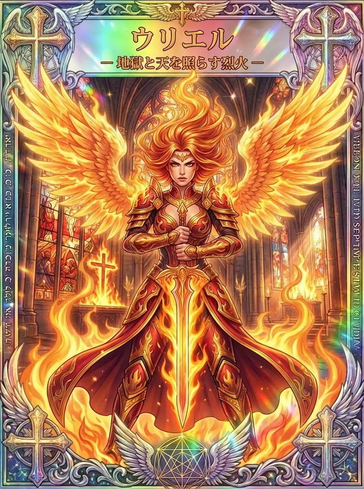

# ウリエル、問いと暗がりを照らす光の天使

考え続けているのに、悩みの中心が見えてこない。誰かに答えを教えてほしい一方で、自分でも納得して選びたい時があります。

ウリエルは「神の光」や「神の火」と結びつけられる天使です。天体の運行を案内する姿や、人生の苦しみを問う人と向き合う姿から、知恵と洞察の象徴として親しまれています。

炎のカードは強く見えますが、その光を「何でも見通す能力」だけで読む必要はありません。分かることを増やしながら、まだ分からないことにも落ち着いて向き合う姿勢を探ってみましょう。

## ウリエルの名前が表す光と、四大天使の考え方

<figure class="niji-kami-card-figure">

</figure>

ウリエルは英語でUrielと表記され、日本語ではユリエルと書かれることもあります。名前はヘブライ語に由来し、「神は私の光」「神の光」、また火を含む意味で説明されます。

ミカエル、ガブリエル、ラファエルにウリエルを加えて四大天使と呼ぶ紹介があります。ただし、これはあらゆる宗派に共通する固定の顔ぶれではなく、ウリエルをどう位置づけるかは伝統によって異なります。

ウリエルの名をたどる時に大切なのは、『第一エノク書』や『第二エズラ書』といった具体的な書物です。単に「聖書に出る」「聖書に出ない」とまとめるより、どの物語の天使なのかを知ると姿がはっきりします。

光には、あたりを暖かくする働きと、隠れていたものを見えるようにする働きがあります。ウリエルの知恵も、安心させるだけでなく、見たくなかった疑問へ目を向けさせるものとして読めます。

たとえば「時間がない」という悩みの中に、頼まれると断りにくい気持ちが隠れていることがあります。予定の数を数えたあとで、自分が何を引き受け続けているかまで見つめると、問題の形は少し変わります。

答えを急ぐ前に、問いを照らす。ウリエルの「光」をこう受け取ると、ひらめきが来るのを待つだけでなく、自分から確かめる一歩を選べるようになります。

## 第一エノク書で教える、太陽と季節の秩序

『第一エノク書』72章では、ウリエルがエノクに天の光るものの運行を示します。太陽が昇り沈む門や日々の長さが語られ、時の巡りを理解するための案内役になっています。[第一エノク書72章](https://sacred-texts.com/bib/boe/boe075.htm)

そこで描かれる宇宙は、現代の天文学と同じ仕組みではありません。太陽の通る門という形で季節や秩序を表す、古代の世界の見方を伝える物語です。

興味深いのは、知恵が一度の鮮やかな思いつきだけで示されないことです。繰り返す動きや日数の違いをたどるところに、世界を理解しようとする細やかな関心があります。

カードの炎を見ると瞬間的なひらめきを連想しやすいですが、天体を案内するウリエルには、時間をかけて変化を見る顔もあります。毎日の小さな違いを見続けることも、洞察につながるのです。

暮らしに置き換えるなら、一日の気分だけで「自分はいつもできない」と決めないことが挙げられます。取り組みやすかった時間、集中を妨げた出来事を、何日か分並べてみましょう。

朝に進まなかった作業が夕方には進むなら、能力より時間帯や環境が関係しているかもしれません。自分に合う条件を見つけるには、良かった日も一緒に残すことが役立ちます。

ウリエルが示す秩序を、自分を厳しく管理する規則に変える必要はありません。自分の暮らしにも波があると認め、その中で続けやすい形を探していけます。

## 洪水の知らせと冥界の役割を、炎だけで決めつけない

『第一エノク書』10章のCharles英訳では、ウリエルがノアへ迫る洪水を知らせる使いとして登場します。ここには、危機を知らせ、生き残るために備えさせる役割があります。[第一エノク書10章](https://sacred-texts.com/bib/boe/boe013.htm)

同じ書物の20章では、ウリエルは世界とタルタロスに関わる天使とされています。タルタロスはこの古い世界観の冥界を表す語で、現代の絵に描かれる燃え盛る地獄とそのまま一致するものではありません。[第一エノク書20章](https://sacred-texts.com/bib/boe/boe023.htm)

このシリーズのカードにある「地獄と天を照らす烈火」は、炎の迫力を強く打ち出す作品の言葉です。ウリエル自身が悪い存在であるとか、カードを引いた人へ罰が下るという意味にはなりません。

洪水を知らせる姿と、見えにくい領域に関わる姿を合わせて読むと、光は楽しい場所にだけ向けられるものではないと感じられます。不都合なことに早く気づくのも、暮らしを守るために必要です。

仕事なら、遅れを隠して何とかしようとする前に、予定が崩れていることを知らせる。小さな段階で現状を共有できれば、分担や締切について話し合う余地が残ります。

不安を大きくすることと、備えを具体的にすることは分けて考えたいですね。「大変なことになる」と繰り返すより、連絡する相手と確認する事柄を一つずつ決める方が行動につながります。

ウリエルの烈火を暮らしで読むなら、恐怖をあおる炎ではなく、見過ごしていたところへ注意を向ける明るさとして使えます。そこから何を選ぶかは、自分の状況を見て決めていきましょう。

## 第二エズラ書では、答える前に問いを返す

『第二エズラ書』4章に登場するウリエルは、エズラに簡単な答えを渡しません。火の重さを量れるか、風を測れるか、過ぎた日を呼び戻せるかという、難しい問いを投げかけます。[第二エズラ書4章](https://ebible.org/eng-web/2ES04.htm)

エズラが知りたいのは、苦しみや不正がある世界で、なぜそのようなことが起こるのかという切実な問題です。単に好奇心を満たしたくて、天上の知識を求めているわけではありません。

ウリエルは、人の理解が届く範囲へ目を向けさせます。そのやり取りには厳しさがあり、いつも優しく何でも教える先生という一言では収まりません。

同時に、エズラはそこで問いを終えません。納得できないことを言葉にし、対話を重ねるため、読者も答えの出ない苦しさとともに物語を進むことになります。

この部分は、研究上「第四エズラ書」と呼ばれる中心部分に含まれます。日本語の聖書で知られるエズラ記や、エノクの天上旅行とは別の物語だと覚えておけば、読み始める時に迷いにくくなります。

生活でも、情報を増やせば解決する悩みと、すぐには理由が分からない出来事があります。理由が分からないままでも、今日の食事や休息、誰かと話す時間を大切にする選択はできます。

「全部分かってから動く」と考えて苦しくなった時は、分からない部分を残したままでできることを探してみましょう。ウリエルの問いは、知恵とともに、自分の限界を受け止める姿勢にもつながります。

## 剣を下へ向けるカードの、静かな緊張感

ウリエルのカードは、赤と金の鎧、炎のように立ち上がる髪、燃える大きな翼が印象的です。周囲にも火が描かれ、七枚の中でも特に正面から強く迫ってくる構図です。

一方で、人物の両手は体の中心で剣の柄を握り、切っ先は下へ向いています。誰かへ斬りかかる動きではなく、その場に踏みとどまって力を保つ姿として眺められます。

目を引く炎だけで「今すぐ戦おう」と読むと、手の静けさを見落としてしまいます。熱い感情があっても、使い方を選ぶためにいったん止まれるという解釈もできるのです。

たとえば、納得のいかない連絡が来た場面を思い浮かべてみてください。すぐに反論を送る代わりに、何が事実と違うのか、何を変更してほしいのかを一つずつ分けて書く読み方ができます。

鎧は身を守るものとして、譲れない条件を考える手がかりにもなります。相手に理解してほしい気持ちと、自分が引き受けられる範囲を、同じ言葉に混ぜずに整理してみましょう。

また、背景には建物の柱や窓があり、炎だけの抽象的な空間ではありません。強い気持ちを持ちながらも、働く場所や生活の条件の中でどう行動するかという、地に足のついた問いへ戻れます。

この人物の姿や表情はカードの創作表現です。ウリエルの性別や普遍的な性格を決めるものではなく、厳しさと落ち着きを一緒に感じられる一つの描き方として味わいましょう。

## 赤や金の意味と、気づきのサインの受け取り方

赤は、このカードでは鎧や衣に使われ、金は炎と翼の輝きをつくっています。どちらが気になるかによって、今の自分が絵から受け取る印象は変わるでしょう。

赤に目が留まるなら、置き去りにしてきた意欲や怒りがないか考えられます。金が気になるなら、今ある材料の中から大切なものを見つけたい気持ちと重ねてもよいでしょう。

ただし「赤が見えたから行動せよ」と、色だけで決断を急ぐ必要はありません。色は気持ちを言葉にする入口で、その先には用件や体力、相手との関係といった現実の条件があります。

「ウリエルがついている人」という言葉に関心がある場合も、特別な能力があるかを試すより、普段の考え方を見てみてください。仕組みを知るのが好きなのか、困った人の話を整理するのが得意なのかでも、光の生かし方は違います。

本を開いた時に必要な言葉が見つかったり、散歩中に考えがまとまったりすることはあります。その偶然を大切にしながら、浮かんだ考えを翌日も読み直すと、使える気づきかどうかが見えやすくなります。

思いついた瞬間の明るさと、続けて役立つ知恵には少し距離があります。「何を思いついたか」に加え、「どの場面で使ってみるか」まで考えると、ひらめきが生活の中に残ります。

## 正教会のウリエルと、火を持つ図像

アメリカ正教会の大天使たちの記念日解説では、ウリエルは神の火または光、照らす者として紹介されています。図像の説明には、右手の抜いた剣と左手の炎が挙げられています。[アメリカ正教会の記念日解説](https://www.oca.org/saints/lives/2026/11/08/103244-synaxis-of-the-archangel-michael-and-the-other-bodiless-powers)

これを知ると、このシリーズの剣と炎にも、伝統的な表現とのつながりが見えてきます。同時に、両手で剣を握る姿や大きく燃える髪は、このカードの独自の構成だと分かります。

同教会の暦では11月8日に、ミカエルやほかの天上の諸力とともに記念されます。暦の採用には教会ごとの違いがあるので、日本のカレンダー上の日付だけで、すべての正教会の行事を同じ日にそろえないようにしましょう。

教会の図像に触れる時は、天使を一人ずつ切り離して能力の一覧にするより、神に仕える存在として描かれている全体にも目を向けると理解が深まります。剣や炎も、その世界観の中で意味を持つものです。

ウリエルを知るために、特定の土地へ急いで出かける必要はありません。信頼できる図像の説明を読み、カードの何が共通し、どこが違って見えるかを眺めるだけでも、見る力が育ちます。

同じ火を持つ絵でも、顔の穏やかさや持ち方が違えば印象は変わります。強い象徴を一つの意味へ閉じ込めず、全体の配置まで見て受け取ることが、ウリエルを楽しむ一つの方法です。

## モヤモヤへ光を当てる、問いの作り方

ウリエルを思い浮かべながら考えを整理するなら、最初の問いを小さくしてみましょう。「この先どうなるか」より「今週の何に困っているか」の方が、扱う範囲を決めやすくなります。

仕事が進まない場合なら、作業量が多いのか、完成の条件が分からないのか、判断待ちなのかを分けます。同じ「忙しい」でも、必要な助けはそれぞれ違います。

次に、確かめられることを一つ選びます。完成の条件が曖昧なら見本を頼み、判断待ちなら、いつ回答をもらえそうかを確認するという形です。

相手の気持ちを何度も推測している時は、自分が実際に聞いた言葉を書いてみてください。そこへ「きっと嫌われた」などの解釈を混ぜずに置くと、まだ尋ねられることが見えてきます。

一方、どれだけ調べても決め手がない時は、何を大切に選びたいかを考えます。速さなのか、続けやすさなのか、家族との時間なのかによって、同じ選択肢の見え方は変わります。

天体の動きを案内するウリエルのように、繰り返しを観察する方法も使えます。同じところで立ち止まるなら、意志が弱いと結論づける前に、その直前に起こっていることを見つめてみましょう。

気づきを得た日は、壮大な結論を出すより、やり方を一つだけ変えて試してみてください。明日も続けられる小ささにすることで、その発見が役立つかを自分の暮らしの中で確かめられます。

## ウリエルへの祈り方は、問いを一つ持つ時間に

静かな灯りの下でノートを開き、今日ひっかかっていることを一行で書いてみましょう。カードに炎があるからといって、実際にろうそくを使う必要はなく、手元の照明で十分です。

「ウリエル、見落としていることに気づき、落ち着いて考えられますように」と呼びかけるのもよいでしょう。この言葉は正式な祈祷文ではなく、振り返りのための祈りの例です。

問いを書いたら、すぐに答えで埋めず、その出来事を少し具体的に思い出します。どこで、誰と、何をしている時に困ったのかをたどると、曖昧だった悩みに輪郭が出てきます。

浮かんだ言葉があれば、短く残しておきましょう。「分担を相談する」「説明を読み直す」など、次にできることが一つ出れば、その日はそこで閉じてかまいません。

何も浮かばない時も、祈りが失敗したわけではありません。分からないことを持ったまま休み、明るい時間に別の角度から考え直すこともできます。

ウリエルを思う時間を、難問に必ず答えを出す試験にしないでください。自分の問いに丁寧に向き合い、必要なら人の知恵を借りる準備として過ごしてみましょう。

## カードを引いたら、今照らせる範囲を選ぶ

ウリエルのカードが出た時は、剣の切っ先が向く足元に目を向けてみてください。遠い未来を一度に見通そうとするより、いま立っている場所から確認する読み方ができます。

決断に迷っているなら、「絶対に間違えない方」を探すだけでなく、決めたあとに調整できる部分を考えます。小さく試せることがあれば、実際の経験が次の判断を助けてくれます。

学びについて引いたなら、知識の量を増やす前に、理解できていない一点を選びましょう。分からない用語を調べ、一つ例を作って説明してみると、どこまで分かったかが見えてきます。

怒りについて引いたなら、その熱が何を守ろうとしているのかを考えられます。大切にしていた約束や努力があるなら、それを具体的な言葉にしてから、伝え方を選ぶことができます。

反対に、疲れている日は強い炎を見続けなくてもかまいません。机の上の一箇所を片づける、明日聞きたいことを一つ書くといった、視界を少し開く行動で終えられます。

ウリエルの知恵は、問いをなくすことより、問いと向き合う姿に見いだせます。いま照らせる範囲を丁寧に見つめることが、次の一歩を選ぶための小さな灯りになるでしょう。

## 参考文献

- [第一エノク書72章](https://sacred-texts.com/bib/boe/boe075.htm)、[10章](https://sacred-texts.com/bib/boe/boe013.htm)、[20章](https://sacred-texts.com/bib/boe/boe023.htm)：R. H. Charles英訳。天体の案内、ノアへの知らせ、タルタロスの担当。
- [第二エズラ書4章・World English Bible](https://ebible.org/eng-web/2ES04.htm)：エズラとウリエルの問いと対話。
- [アメリカ正教会・大天使たちの記念日](https://www.oca.org/saints/lives/2026/11/08/103244-synaxis-of-the-archangel-michael-and-the-other-bodiless-powers)：正教会の呼称、剣と炎の図像、暦上の記念日。
