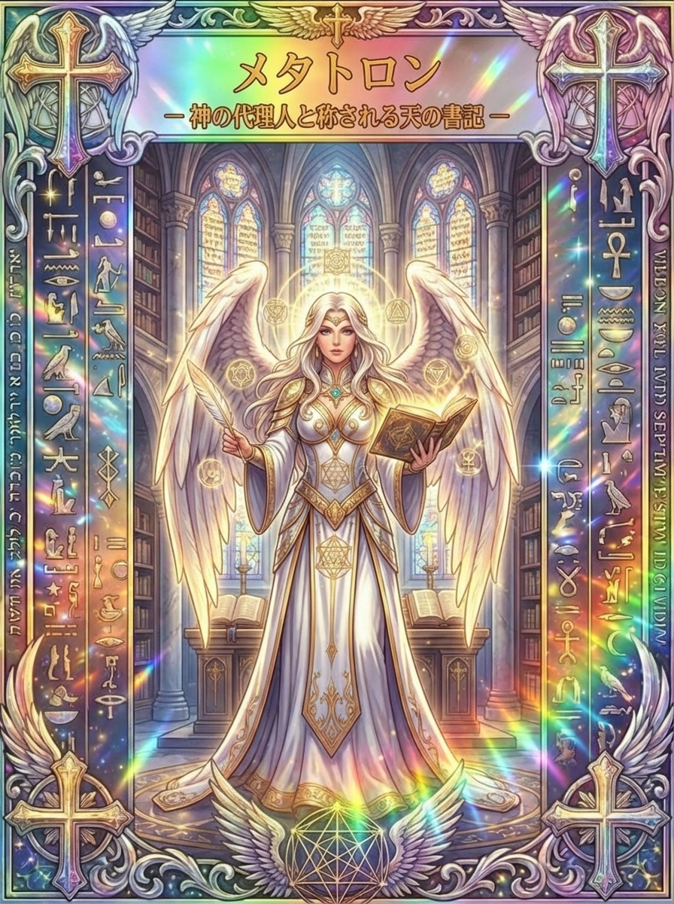

# メタトロン、天の書記に託された記録と知恵

やることが頭の中で重なって、何から手をつければよいのか分からない。自分なりに努力してきたはずなのに、その歩みまで見失うことがあります。

メタトロンは、天の書記として語られる天使です。人間のエノクが天へ上げられ、特別な役目を担う存在へ変えられたという物語には、記録と学び、立場が変わることの不思議が重なっています。

名前を聞いて「メタトロンキューブ」や健康関連の機器を思い浮かべる方もいるでしょう。まず天使の物語を知り、名前の似たものとの違いを整理しながら、書くことで日々を見渡すヒントを探していきます。

## メタトロンとは？天に仕える書記の姿

<figure class="niji-kami-card-figure">

</figure>

メタトロンは、ユダヤ教のラビ文献や神秘思想の中で語られる天使です。英語ではMetatronと書き、神の近くで働く高位の存在、また記録を担う書記として知られています。

ガブリエルやラファエルのような、語尾に「エル」を持つ名前とは形が異なります。名前の由来にはギリシャ語やラテン語と関連づける説がありますが、一つに確定した意味はありません。

「玉座の後ろにいる者」という説明を見かけても、それを確定した語源として覚える必要はないのです。メタトロンの場合は、名前の翻訳より、どのような役目で描かれるのかを追う方が、その魅力に近づけます。

天の書記という呼び名からは、出来事を見届け、忘れられないように残す姿が浮かびます。目立つ結果だけでなく、人の歩みを扱う役目として考えると、記録という行為が温かく見えてきます。

たとえば、忙しかった一日の終わりに「何もできなかった」と感じることがあります。それでも書き出してみれば、相談に応じた時間や、次の仕事の準備など、形に見えにくい働きが残っています。

メタトロンの物語は、日記を書けば特別な力が身につくという話ではありません。流れてしまう日々へ目を向け、どんなことがあったのかを丁寧に扱うための入り口になります。

## エノクが天へ上げられた物語の、その先へ

エノクは『創世記』に登場する人物です。神とともに歩み、神に取られたためにいなくなったという短い記述が、のちの豊かな天上の物語につながっていきます。

この短い場面だけには、メタトロンという名前や、天使への詳しい変化は書かれていません。人間エノクと天使メタトロンをはっきり結びつけて語るのが、後世の『第三エノク書』の伝承です。

そこでは、天へ上った人物がメタトロンと出会い、エノクとしての由来や天上の働きを聞きます。地上に生きた記憶と、今は天に属する立場が、一人の存在の中で語られるところが印象的です。

変化の描写には、人の体が火や光を帯びた天上の姿へ変えられるような壮大さがあります。白い衣の穏やかな書記というカードの印象だけでは収まらない、強烈な神秘の世界です。

一方で、人間だったという来歴が消えてしまうわけではありません。今の姿がどれほど遠く見えても、そこへ至る前の歩みが語られることに、この天使の独特な近さがあります。

暮らしでも、新しい役割を得る時に、それまでの自分を全部捨てなければと思うことがあります。けれど、以前の仕事で身につけた聞き方や、うまくいかなかった経験も、別の形で役立つかもしれません。

エノクの変容を私たち自身の未来の約束として受け取る必要はありません。変化の中でも歩みがつながっているという物語として読むと、自分の過去を見る目が少しやわらぎます。

## 高い位にいても「若者」と呼ばれる理由

メタトロンには「若者」という呼び名もあります。第三エノク書の物語では、ほかの天使たちに比べて天上へ加わった時が遅いことと、その呼び名が結びつけられています。

地上での年齢と、天使たちの間での立場が同じ尺度ではないところに、神秘文学らしい面白さがあります。高い役目を与えられた存在が、同時に若者として呼ばれるのです。

物語には、人間に由来する存在が天上で役目を担うことへの、ほかの天使たちの反応も描かれます。誰からも最初から当然のように迎えられるだけではなく、新しい立場が認められる過程があるのです。

この呼び名から、子どもだけを守る専門の天使だと結論づける必要はありません。若さを単なる年齢の意味へ縮めず、場によって経験の長さが違うことを考えると、より豊かに味わえます。

私たちも、長く働いてきた人でありながら、新しい分野では初心者になることがあります。慣れた場所での自信と、知らないことを尋ねる姿勢は、一緒に持っていてよいものです。

初めて学ぶ時は、分からない用語をそのままメモしておきましょう。後から意味を調べたり、人へ聞いたりできるようにしておけば、知らないことが学びの入口に変わります。

メタトロンの若者という顔は、「今さら聞けない」と固くなった気持ちにも合います。役割を持ちながら学び続ける姿として眺めると、記録する手も軽くなるでしょう。

## 天の記録が示す責任と、神との距離

ラビたちの伝承には、メタトロンが座ってイスラエルの功績を書き留める場面があります。その姿を見た人物が、天には二つの権威があるのではないかと誤って考えてしまう物語です。

ここで大切なのは、書記の特別な立場を、そのまま神と同格の存在へ置き換えないことです。伝承はメタトロンの近さを描きながら、神と天使の区別も強く意識しています。

別のラビの議論でも、メタトロンと神の名の関係が語られる一方、神に代えて天使を礼拝することは認められていません。「神の代理人」という短い呼び名だけでは、この距離感を伝えきれないのです。

カードの副題にも「神の代理人と称される天の書記」とありますが、神に仕えて役目を担う存在という方向で読むと分かりやすくなります。強い肩書きは、独立した全能を意味するものではありません。

書記という仕事にも、任された内容を勝手に変えずに扱う責任があります。何が起きたかと、それを自分がどう感じたかを分けて残すことは、私たちの記録でも役立ちます。

たとえば「会議で意見を否定された」と感じた時、まず実際に言われた言葉を残してみます。その横に悲しかった気持ちを書けば、感情を消さずに、出来事を振り返る余地も持てます。

記録は自分に厳しい判決を下す道具でなくてかまいません。あとで読み返す自分が状況を理解できるよう、分かっていることを誠実に置いておく行為として考えてみましょう。

## 本と羽根ペン、本棚に囲まれたカードの読みどころ

このメタトロンのカードでは、白と金の衣をまとった人物が、本と羽根ペンを持って立っています。背後には高い本棚があり、足元近くの台にも開かれた本が置かれています。

本を一冊持つだけでなく、周囲にも多くの本があるため、知恵が積み重なっている空間として感じられます。すべてを頭の中に抱えるのではなく、残されたものを参照できる場所とも読めるでしょう。

片手の本はすでにある記録、もう片方のペンはこれから書き加える言葉を連想させます。振り返る時間と、新しく選ぶ時間の両方が、一枚の中に置かれているように見えます。

服や周囲には幾何学的な模様が点在していますが、絵全体を見ると人物の姿勢は静かです。複雑なことを一度に理解しようとせず、手元の一頁から向き合うという読み方ができます。

ラジエルのカードも本を持ちますが、こちらは羽根ペンと本棚の存在が特徴です。秘密を開く驚きだけでなく、学んだことを残し、必要な時に取り出す営みに注目すると、メタトロンらしさが見えてきます。

白い衣を完璧さの要求と考えなくても大丈夫です。余白のある頁のように、まだ書かれていないこと、これから整えられる部分があると受け取ることもできます。

カードを眺めたあとで机へ戻ったら、探していたメモを一つまとめてみましょう。本棚のように自分が戻れる場所を作ることが、この絵の静けさを暮らしへ持ち帰る方法になります。

## メタトロンキューブと数字の楽しみ方

メタトロンキューブは、円と直線を組み合わせた幾何学模様として知られています。現代のスピリチュアルな図形の紹介では、十三個の円と、それらの中心を結ぶ線で説明される形が見られます。

ただし、その呼び名を第三エノク書の物語へそのままさかのぼらせることはできません。天の書記という伝承と、現在この名前で親しまれている図形は、分けて眺めると混乱しにくくなります。

このカードにも線で組まれた模様がありますが、すべてをメタトロンキューブと決めつけず、まず形そのものを見てみましょう。円に見えるのか、星形に見えるのか、重なる線の密度はどうかという観察から始められます。

図形に惹かれる理由は、人によってさまざまです。対称な形に落ち着きを感じたり、線がつながる様子から、ばらばらだった考えの関係を連想したりするかもしれません。

考えを整理したい時は、丸の中へ用件を書き、関連するものを線でつなぐ方法も使えます。書類、連絡、予定がどう関わっているかが見えれば、先に確認すべきことを選びやすくなります。

その図を美しく完成させることより、自分で読めることを優先しましょう。線が交差しすぎたら、今日扱う部分だけ別の紙へ移すと、全体と目の前の作業を行き来できます。

十三という数を見かけた時も、天使からの特別な命令として行動を決めなくてかまいません。図形を思い出したなら、散らばった考えを少し並べ直す合図にする程度で楽しめます。

## 健康機器の「メタトロン」と、天使の話は分けて考える

「メタトロン検査」という名前から、この天使を知る方もいるでしょう。健康関連のサービスや機器に使われる名称と、ユダヤの伝承で語られる天使は、同じ名前でも別の話です。

天使が知恵を持つという伝承は、機器が病気を診断できることや、治療に役立つことを裏づけません。図形を見て心地よく感じることも、体内の状態を医学的に測定したこととは区別されます。

機器について知りたい時は、製品名や型式、何を測るものとされているのか、その用途の裏づけを個別に確認する必要があります。名前だけで「医療機器である」「医療行為ではない」と一律に決めることも避けたいところです。

バイオレゾナンスと呼ばれる関連分野の説明を読む時にも、体験談と、診断や治療に使えることを示す臨床的な裏づけは分けて考えましょう。ある機器について語られる内容を、名前や仕組みが似ている別の製品へ、そのまま当てはめることもできません。

体調について不安があるなら、症状や経過を整理して医療機関へ相談しましょう。機器の表示だけをもとに、受診や治療、処方薬を変える判断をしないことが大切です。

メタトロンの「記録」というテーマは、相談したいことを書き留める場面なら生かせます。いつから、どんな時に困っているかを伝えやすく整えることと、天使の力で診断することは、はっきり分けておきましょう。

## 天の書記を思い浮かべる、三行の記録

一日の終わりに記録をつけるなら、まず「起きたこと」「気づいたこと」「次にすること」の三行を用意してみましょう。長い日記を書く気力がない日にも、出来事の輪郭を残せます。

「資料を送った」「相手が必要としていたのは説明より見本だった」「明日は見本を先に添える」という形です。結果を並べるだけでなく、経験を次の行動へつなげられます。

うまくいかなかった日も、最初の一行を自分への評価にしないようにしてみてください。「自分はだめだった」ではなく、「予定していた二つのうち一つが終わらなかった」と書けば、見直す範囲が明らかになります。

その理由が急な対応なら、翌日の予定を詰め直す前に、予備の時間が必要だったと気づけます。知識が足りなかったなら、調べることを一つ決める方が、自分を責め続けるより役立ちます。

また、記録には自分が受けた助けも残しておきましょう。「同僚が確認してくれた」「家族が時間を作ってくれた」と書けば、努力の足跡だけでなく、支えられてきた歩みも見えてきます。

誰かに見せる予定がないノートなら、きれいな言葉へ直す必要はありません。あとで読んだ時に、その日の自分が何に向き合っていたか分かることを大切にします。

天の書記のように、すべてを漏れなく記録しようとしなくて大丈夫です。今の自分に必要な一頁を残すことから始めれば、記録が新たな負担になるのを避けられます。

## 俯瞰する力は、約束と役割を見渡すことから

メタトロンの高い位置から全体を見るイメージは、目の前の用件を少し離れて考える時にも使えます。紙の中央に自分の名前を書き、仕事や家庭で担っている役割を周りへ置いてみましょう。

それぞれに、今週約束したことを一つずつ添えます。頭の中では別々だった予定が同じ時間を使っていると気づけば、優先順位を相談すべきところが見えてきます。

大切なのは、一人ですべてを回せるようになることだけではありません。どこまでなら引き受けられるかを伝え、必要な場面では助けを頼むことも、全体を見る力に含まれます。

橋渡しの役割をしている時は、誰の言葉を誰へ渡すのかを明確にしましょう。相手の希望と自分の意見を混ぜずに伝えると、行き違いを減らすための会話がしやすくなります。

たとえば「みんな困っています」と広げるより、「担当者から、この確認が必要だと聞いています」と言う方が、次の相談先を決めやすくなります。書記の責任を、伝達する人の丁寧さとして生かせる場面です。

ノートや予定表を整理したあとには、見る場所も一つ決めておきましょう。残すだけで終わらせず、次の自分が取り出せる形にすることが、カードの本棚から受け取れる工夫です。

## メタトロンのカードを引いた時の、書く祈り

このカードが出たら、いま開いている本に何を書き足したいかを想像してみてください。過去の自分を裁く言葉より、これからの自分が迷った時に読める言葉を選んでみましょう。

静かな時間に「メタトロン、私の歩みを見失わず、必要なことを残せますように」と心の中で唱え、今日大切だったことを一行書くのも一案です。これは伝統的な儀礼ではなく、カードの書記の姿から考えた振り返りの例です。

仕事なら、次の人に渡しておきたい情報を書きます。生活なら、今週守りたい約束や、頼まれてうれしかったことなど、自分が覚えておきたい内容でかまいません。

何も進んでいないと感じる時は、先週の記録を少しだけ開いてみてください。以前は分からなかった言葉が読めるようになったなど、小さな変化に気づくこともあります。

逆に、書くほど苦しくなる日は、その日の記録を短く終えてよいのです。「今日は休む」と残してノートを閉じることも、自分の状態を無視せず記した一行になります。

白い頁には、まだ決まっていないことが残っています。メタトロンのカードを、自分の未来がすべて書かれている本としてではなく、今日の選択を丁寧に残すための一枚として受け取ってみましょう。

その一行が後日、迷っている自分へ道筋を示すことがあります。天の書記という遠い物語は、手元の記録を通して、自分の歩みを大切にする身近な時間へつながっていきます。
