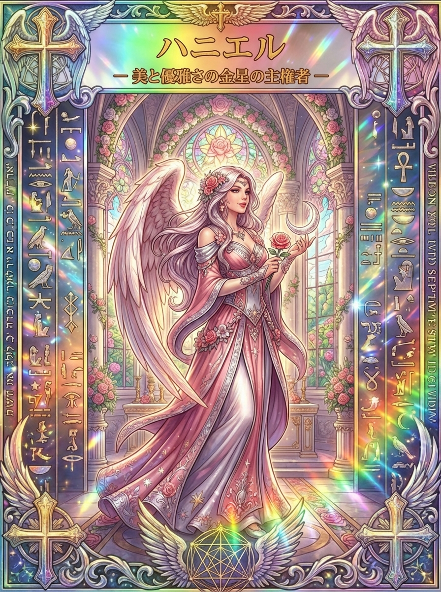

# ハニエル、美と優雅さから自分らしさを見つめる天使

「自分らしく働きたいけれど、何が向いているのか分からない」「人に合わせるうちに、自分の好みまで見失ってしまった」。そんな時、ハニエルのカードに描かれた薔薇や柔らかな身のこなしは、自分の感覚へ戻るきっかけになります。

ハニエルには西洋の神秘思想で金星と結びつけられる姿があり、このシリーズでは美と優雅さが主題になっています。文献にある役割を確かめたうえで、天命や人との調和を日常の言葉に置き換えてみましょう。

## ハニエルとは？「神の恵み」という名を手がかりに

<figure class="niji-kami-card-figure">

</figure>

ハニエルは、西洋の神秘思想で金星や美の主題と結びつく天使です。名前はHanielなどと綴られ、日本語ではハナエルに近い表記も見られます。

名は「神の恵み」と説明されますが、恵みとは、特別な才能を持つ人だけに与えられる勲章のようなものでしょうか。カードの柔らかな姿を眺めると、すでに手元にあるものを丁寧に受け取る、という意味でも考えたくなります。

何気なく選んでいる服の色、料理を盛りつける時のひと工夫、相手が困らないように添える一言にも、その人らしさは表れます。自分には何もないと感じる時ほど、日常の小さな選び方から魅力を拾ってみるとよいでしょう。

聖書にはハニエルに近い名を持つ人間も登場しますが、その人物が天使になったという物語ではありません。天使ハニエルの背景を知る入口になるのは、後世の西洋で育まれた天使と星の結びつきです。

「美しい」と感じる対象は人によって違います。ハニエルの美を自分に重ねる時も、誰かの理想の姿に近づくより、自分がどんなものに心を動かされるのか、ゆっくり確かめてみてください。

## 金星とネツァク｜優雅さの奥にある続ける力

ルネサンス期の西洋神秘思想には、ハニエルを金星と、勝利を意味するネツァクに対応させる考え方があります。権天使の位階とも結びつくこの姿は、ただ穏やかに微笑むだけの天使像とは少し違う奥行きを持っています。

そこに見えるのは、魅力と意志が離れていないという面白さです。美しいものへ心が向く力には、気に入った一枚を探す、表現を工夫する、完成まで手を入れるといった、地道な働きも含まれます。

たとえば花を飾る時は、花瓶を選び、水を替え、光の当たり方を見ます。一瞬の華やかさを味わうだけでなく、よい状態を保つ小さな世話があるから、暮らしの中で楽しみが続いていきます。

カードを読む時の「勝利」も、他人を負かすことより、大切にしたい感覚を見失わず育てる姿勢として受け取れます。好きなことを続けられる条件を整えると、優雅さの中にある粘り強さが見えてきます。

作品を作る人なら、反応の多さだけで方向を決めず、どの部分を自分で気に入っているか確かめてみます。評価を受け止めながら、残したい持ち味も言葉にしておくと、修正のたびに自分らしさが消えてしまうのを防げます。

うまくいかない日にも、全部をやめるか、無理に頑張るかの二択にしなくてよいのです。作業を半分にする、好きな工程だけ少し進めるなど、続けるためにやり方を変える選択もあります。

この粘り強さは、張りつめた決意より、何度でも戻りたくなる親しみから生まれることがあります。ハニエルの薔薇を、自分がまた手を伸ばしたくなる仕事や楽しみの象徴として見てみましょう。

## 金星と月のイメージ｜アナエルとの違いも知る

金星に関わる名には、アナエルもあります。西洋の魔術の伝統には金曜日とアナエルを結ぶものがあり、ハニエルと近づけて語られる場合もありますが、このシリーズでは別々のカードとして扱っています。

星の対応は、すべての時代や宗教で共通する一つの体系ではありません。ハニエルを金星に置く体系で月には別の天使が配されることもあり、名前や星の印象をまとめて一つにしてしまわないことが大切です。

一方、手元のハニエルのカードには、金星の主題とともに三日月形の飾りが描かれています。月を含むこの姿はカードの表現として、満ち足りた美しさだけでなく、まだ育ちきっていないものを慈しむイメージへつなげられます。

新しい仕事に慣れる途中なら、今できていることと、まだ助けが必要なことが混ざっているでしょう。未完成の部分があるままでも、すでにできている工夫を認めることはできます。

金曜日を振り返りの日に選ぶのも、一つの楽しみ方です。週の終わりに「今週、心がほどけた場面はどこだったか」と思い返すと、予定表の中にも自分に合う過ごし方の手がかりを見つけられます。

月夜が好きなら、空を見上げる時間をつくってみてもよいでしょう。夜更かしや特別な儀式を課すのではなく、窓から空を眺める数分を、忙しさからいったん離れる時間にします。

雨の日や月が見えない日も、その時間の意味は失われません。空の見え方と自分の価値を結びつけず、今日はどんな一日だったか、自分の言葉で振り返ることを中心に置きます。

## 薔薇と三日月、桃色の衣を実際のカードから読む

このカードの上部には「美と優雅さの金星の主権者」と記されています。中央の人物は桃色と白の長い衣をまとい、片手に薔薇、もう片方の手の上に三日月形の飾りを見せています。

髪飾りにも衣にも薔薇があり、背後のアーチや丸い窓にも花の意匠が繰り返されます。美しさが一つの道具に集まるのではなく、身につけるもの、建物、周囲の空間へ広がっているところが、この絵の特徴です。

ここから「身の回りを自分の感覚で少しずつ整える」と読むことができます。特別な衣装を買うより、よく使うカップや机の位置など、毎日の接点を一つ選ぶ方が、カードの美しさを自分の生活へ移しやすいでしょう。

薔薇を持つ手と、三日月形の飾りを受ける手には違いもあります。カードの読み方の一例として、前者を自分がすでに育てているもの、後者をまだ名前のついていない可能性に見立てると、今ある魅力とこれからの変化を同時に考えられます。

全体を包む白い翼と長い衣の曲線は、急ぐ姿というより、立ち止まって味わう姿として受け取れます。桃色や曲線の美しさを楽しむことに、性別の条件をつける必要はありません。

もう一つ目を向けたいのは、窓の光が人物だけでなく床や柱にも届いていることです。自分だけを美しく見せるという読み方から、過ごす場所や周囲との関係まで含めて心地よくするという読み方へ、視点を広げられます。

たとえば来客を迎えるなら、豪華な飾りより、荷物を置ける場所や話しやすい椅子の位置を整えることかもしれません。見た目の印象に、そこにいる人の使いやすさが伴うと、このカードの調和を具体的に考えられます。

花に囲まれた窓には、外の光を室内へ迎え入れる働きも感じられます。自分の世界を守りながら新しいものを受け入れる姿として眺めると、好みを大切にすることと、変化を楽しむことを両立させられそうです。

## 優雅さとは、人に合わせ続けること？

「優雅でいたい」と思うほど、不機嫌を見せないことや、頼まれたことを全部引き受けることを目標にしてしまう場合があります。けれど、表面だけを整えて疲れを隠す暮らしでは、自分が心地よいと感じる余地が少なくなります。

このカードの薔薇は、誰かに差し出される途中というより、本人の手元に大切に保たれています。そこから「自分の好みや時間も丁寧に扱う」と読むと、美しさは相手へのサービスだけで終わりません。

たとえば週末の予定を頼まれた時、「行けます」と即答する前に、休む時間を残せるか確かめます。断る場合も「その日は難しいですが、来週なら一時間ほど」と、自分の余裕に合う範囲を伝えられます。

優雅さを話し方に置き換えるなら、飾った言葉を増やすより、相手にも自分にも無理のない返事を選ぶことです。伝える内容がはっきりしていると、優しい表現の中にも安心して受け取れる輪郭が生まれます。

美しいものが好きでも、いつも静かに振る舞える必要はありません。悔しさや疲れに気づいた時は、その感情が何を知らせているのか一度確かめることも、自分を粗末にしないための調和です。

## 「ハニエルと天命」を考える三つの手がかり

天命という言葉には、最初から一つだけ決まった職業や役目が隠れているような響きがあります。けれど、カードを引いた瞬間に、一生の役割を決めなければならないわけではありません。

ここからはカードの美と優雅さを用いた、独自の振り返り例です。「好きなこと」「人に自然と頼まれること」「無理なく続けたいこと」の三つを、それぞれ具体的な場面として書き出してみます。

好きなことは「芸術」のような大きな分類より、「写真の色を並べて一枚を選ぶ時間が好き」という細かさで捉えます。大きな肩書きにしない方が、自分のどの感覚が働いているのか見つけやすくなります。

人に頼まれることも、何でも受け入れる理由にはしません。「説明が分かりやすいと言われるけれど、大人数の前より一対一の方が落ち着く」と、得意なことと適した条件をセットで考えます。

続けたいことは、頑張ればできる量ではなく、翌週も取り組みたいと思える量で測ります。三つの項目が重なる小さな作業を見つけたら、仕事に変えるかどうかを急がず、まず一度試すところから始められます。

たとえば、友人の相談を聞き、言葉を整理して返す時間が好きなら、十五分の聞き役を引き受けてみます。終わった後に「役に立てた点」と「疲れた点」を両方残すと、自分に合う関わり方の条件が見えてきます。

試してみて想像と違っていても、天命を逃したと捉える必要はありません。「話を聞くことは好きだが、すぐ助言を求められると困る」と分かったなら、それも役割を選ぶための具体的な発見です。

次は、聞いたことを短くまとめる役に変えてみるなど、合わなかった条件だけ調整できます。自分らしさは一枚の札に固定するものではなく、経験を重ねる中で言葉にできる部分が増えていくものとして扱います。

<strong>天命を一度で言い当てるより、心が動いた理由を確かめながら役割を育てる。</strong>そう考えると、答えがまだ出ていない時期にも、意味のある一歩を置けます。

## 感性と直感を、確かめられる言葉にする

直感を大切にするというと、最初に浮かんだ答えへ従うことだと思われがちです。ハニエルのカードを使うなら、その感覚の細部を言葉にしてから、生活の条件と照らし合わせる方法が向いています。

ある場所を見て「ここが好き」と感じたら、光の入り方、音の少なさ、机の広さなど、好きな理由を分けてみます。同じ条件の一部を自宅に取り入れられれば、その感覚を遠い憧れのままにせず使えます。

逆に「この誘いは何となく気が進まない」と感じた時は、相手への印象と、予定や費用への負担を混ぜないようにします。日程が厳しいだけなら別の日を提案でき、内容が合わないなら参加しない選択ができます。

この振り返りで育てるのは、未来を透視する能力ではなく、自分が何に反応しているかを知る言葉です。感覚を尊重しながら理由を確かめると、気分が変わった時にも自分の判断を理解しやすくなります。

「月が綺麗に見えた」「同じ色が目についた」といった出来事も、その日の自分が何に心を向けたかという記録にできます。外からの命令として扱わず、自分の注意が向いた先を知る材料として残してみましょう。

## 身近な空間に美しさを取り戻す小さな実践

カードの薔薇のアーチを生活へ置き換えるなら、まず一日に何度も目にする場所を選びます。玄関の鍵置き場、作業机の端、寝る前に手を伸ばす棚など、一か所で構いません。

そこへ何かを足す前に、今あるものを見渡して、好きで残しているものと、置き場がなくて残っているものを分けます。美しさを買い足し続けることと、自分の感覚に合う空間を作ることは同じではありません。

花を置くなら、生花でも手元の写真でも、自分が扱いやすい形を選びます。見栄えだけでなく、手入れにかかる時間まで含めて心地よいかを考えると、優雅さが新しい義務にならずに済みます。

一週間後には「ここを見る時、何が変わったか」と確かめます。鍵を探す時間が減った、仕事の前にお気に入りが目に入るなど、暮らしの中の変化を言葉にできれば十分です。

反対に、飾ったものが邪魔になったり、手入れが負担になったりしたら、位置や数を変えてみます。最初に選んだ形へこだわるより、実際に暮らしている自分の感覚を優先する方が、ハニエルの主題を生かした工夫になります。

「好きだから買う」だけでなく「好きだから手元で長く使えるようにする」という選択もあります。使い慣れた道具を拭く、欠けた収納の仕切りを直すなど、今あるものへの手入れにも、このカードの恵みを見いだせます。

人との調和へ生かす場合は、相手の良いところを一つだけ具体的に伝えます。「すてきですね」から一歩進めて「説明の順番が分かりやすく、迷わず選べました」と伝えると、相手の持ち味を丁寧に扱う行動になります。

## ハニエルへの祈りを、自分の声を聞く時間に

ここで紹介するのは、カードに向き合うために作った短い言葉であり、古い祈祷文や魔術書の儀式ではありません。天使への呼びかけに馴染みがなければ、自分への問いとして読み上げても構いません。

カードの薔薇を見ながら「ハニエル、私がすでに大切にしているものに気づけますように」と心の中で言います。次に三日月形の飾りへ目を移し、「これから育てたいことを、小さく試せますように」と続けます。

その後に、今大切にしているものと、これから試すことを一つずつ書きます。「人と丁寧に話す時間を守る」「週末に短い文章を一本書く」など、翌日に意味が分かる具体的な言葉にしておきます。

何も浮かばない日は、無理にメッセージを作らず、絵の中で一番気になる色だけ記録して終えてもよいでしょう。答えを出す速度より、自分の感覚を急かさず扱う姿勢を大切にします。

## カードが出た日の読み方｜魅力を育てる方向を選ぶ

仕事について引いた時は、薔薇を「すでに喜ばれている持ち味」として見てみます。何を増やすかだけでなく、その持ち味を発揮しやすい時間や相手、作業の順序を整えることが次の一手になります。

人間関係についてなら、柔らかい衣の曲線を「角を立てずに伝える工夫」、手元の薔薇を「譲りたくない大切なもの」として組み合わせられます。相手を優先するか自分を優先するかの二択にせず、両方が分かる言い方を探します。

自分の魅力が分からない時は、全体の華やかさより、同じ薔薇が何度も描かれている点に注目します。あなたにも繰り返し選んできた色、言葉、働き方があるなら、その共通点から持ち味を考えられます。

一枚のカードから職業名や天命を決め切る必要はありません。「何を大切にしてきたか」「何を無理なく続けたいか」という問いを持ち帰ることで、ハニエルの美と優雅さが、今日の選び方に結びついていきます。
