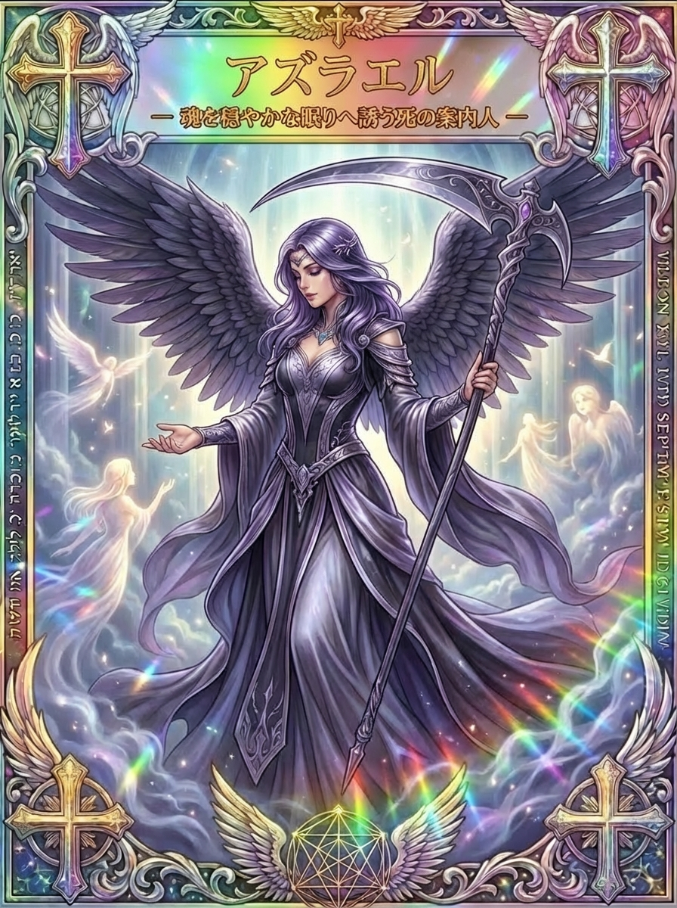

# アズラエル、魂の旅立ちと別れを見つめる天使

「死の天使」という呼び名に、怖さを感じる人もいるでしょう。アズラエルは命の終わりに関わる存在として語られ、このカードでは、開いた手と静かな表情で魂を迎える姿に描かれています。

大切な人との別れや、長く続いた生活の終わりは、簡単に前向きな言葉へ置き換えられないものです。アズラエルの背景と図柄をたどりながら、急いで立ち直ろうとせず、大切だったものを丁寧に扱う時間を考えてみましょう。

## アズラエルとは？命の終わりに関わる天使

<figure class="niji-kami-card-figure">

</figure>

アズラエルはAzraelなどと綴られ、イスラムの伝承ではイズラーイールに近い名でも知られる天使です。命の終わりに魂を受け取る、死の天使と結びつけられています。

その役目は、気まぐれに人を選んで襲う怪物という設定とは異なります。神から託された働きを担う存在として捉えられ、人の生と死が、より大きな秩序の中にあるという宗教的な考え方に関わります。

「神が助ける」といった名の説明も見られますが、語源の説明だけで天使の働きのすべてが決まるわけではありません。中心にあるのは、魂を受け取る務めと、それを命じられる立場です。

現代のカードでは、この役目から、別れを迎える人や悲しむ人に寄り添う象徴へ意味が広げられることがあります。魂の慰めという読み方は、その現代的な受け取り方として味わえます。

アズラエルを知るために、死を怖くないと思い込む必要はありません。怖さや寂しさがあるまま、その言葉の背景や絵の静けさに少しずつ触れていくこともできます。

## イスラムの死の天使と、後から知られる名前

クルアーンには、人を担当する死の天使が魂を受け取り、人々が主のもとへ帰ると語られる場面があります。そこでは固有名のアズラエルではなく、「死の天使」という役目の名で呼ばれています。

イズラーイールという名は、後の伝承や解説の中で知られるようになったものです。クルアーンの言葉と、後に語られた名前や姿を区別すると、この天使の来歴を理解しやすくなります。

イスラムの伝承では四大天使の一人に数える説明もありますが、それぞれの名が同じ形で聖典本文に並んでいるわけではありません。アズラエルを、本文に名前まで明記された天使として紹介しないことが大切です。

また、魂を受け取る場面には、天使が人々へ平安を告げる表現と、厳しく向き合う表現の両方があります。どんな場面でも穏やかな案内だけが描かれている、という単純な物語ではありません。

そこには、生き方や神の裁きに関わる宗教的な意味が含まれています。現代のカードが描く優しい案内人の姿は、その世界観をそのまま一枚に再現したものではなく、終わりに寄り添う面を前に出した表現です。

名前や姿の背景を知っておくと、黒い翼を見ただけで悪い天使と決めたり、優しい表情だけで古い伝承もすべて同じだと考えたりせず、この絵を一つの表現として受け取れます。

## 「死の天使」と「死神」は同じ存在？

黒い服や鎌を見て、西洋の死神の姿を連想することがあります。けれど、死を一つの人物として表す図像と、神の命を受けて働く天使という立場は、同じものとは限りません。

このカードには大鎌が描かれていますが、クルアーンの死の天使の記述が、そのまま黒い翼と大鎌を定めているわけではありません。ここでは「終わり」を連想させる姿と、天使の案内役という主題が組み合わされています。

ユダヤの伝承にも死の天使という考え方があり、複数の名前や物語が伝えられています。そのすべてを一人のアズラエルの体験談としてつなげると、各伝承の違いが見えなくなります。

ゲームや漫画でのアズラエルにも、作品独自の性格や能力があります。強い戦士として登場しても、それが宗教の伝承での役割をそのまま示しているとは限りません。

こうした違いを知ったうえでカードを見ると、鎌の形だけへ怖さを集めず、表情や手の動きにも目が向きます。何を持っているかと、誰にどう向き合っているかを一緒に見ることが、この一枚を読む大切な手がかりです。

## 黒紫の翼と差し出す手｜静けさを描くカード

中央のアズラエルは黒紫の翼を大きく広げ、長い紫色の衣をまとっています。片手で大鎌を支えながら、もう一方の手を、周囲の淡く光る人影へ向けて開いています。

顔は穏やかに伏せられ、誰かを威嚇するような表情ではありません。鎌の大きさが生む緊張と、相手を迎える手の柔らかさが、一枚の中に同時にあります。

周囲の人影は明るく、背景にも白や青緑の光が差しています。全体が真っ暗に塗りつぶされているのではなく、暗い翼の輪郭があることで、光るものの存在が見えやすくなっています。

この対比を、悲しみの中にも消えていない記憶や関係の象徴として読むことができます。別れによって会えなくなっても、一緒に過ごした時間までなかったことになるわけではありません。

差し出された手は、急いで立ち上がらせるより、相手が近づける余地を残しているように見えます。悲しんでいる自分や誰かへ、今すぐ答えを求めずにそばにいる姿として受け取れます。

上部には「魂を穏やかな眠りへ誘う死の案内人」と記されています。これはカードの詩的な言葉であり、実際の死後の状態を確認する説明ではなく、絵の静かな雰囲気を味わうための入口です。

鎌を見て負担を感じるなら、無理に全体を眺め続けなくても構いません。開いた手や背景の淡い光など、自分が落ち着いて見られる部分から、このカードに向き合えます。

## 別れに向き合う時、感謝だけでまとめなくてよい

大切な人との別れを思い返す時、嬉しかった記憶だけでなく、言えなかったことや怒りが浮かぶ場合があります。感謝の言葉にきれいにまとめられないからといって、その関係を大切にしていなかったことにはなりません。

カードの開いた手を、気持ちを一つにそろえず置いておける場所として見立ててみます。「会いたい」「寂しい」「あの時は分かってほしかった」という異なる言葉が並んでいてもよいのです。

たとえば短い手紙を書くなら、相手に見せる前提を外し、今いちばん言いたい一文から始めます。書き終わりを前向きに整えず、途中で止めても、自分の中にあった言葉を置くことはできます。

手紙を書く気になれない日は、その人を思い出す品を一つ見るだけでも構いません。記憶へ近づきたい日と、少し離れていたい日があるなら、その日の自分が選べる形にします。

周囲が「もう元気になった」と感じても、自分の中では別の時間が流れていることがあります。外から見える様子に合わせて、気持ちまで急いで変える必要はありません。

アズラエルを慰めの象徴として読む時は、悲しみを取り去ってもらうことだけを目指さず、悲しみを抱えた自分の居場所を作ることも考えてみましょう。何かを終えた後も、すぐ次の役割へ移らなくてよい時間があります。

## 思い出の品を、今の自分が扱える形にする

思い出の品は、持っているとつらいのに、手放すこともつらい場合があります。アズラエルの「終わり」の主題を、処分を急ぐ命令として使う必要はありません。

まず、今そばに置きたいものと、今は見えない場所で休ませたいものを分けます。どちらにも、相手との時間を大切に思う気持ちがあり得ます。

一つの箱にまとめるなら、中身を簡単に記しておくと、後から何があるか確かめやすくなります。きちんと整理できる量だけ進め、残りは別の日に回してもよいでしょう。

写真に残す方法が合う人もいれば、実物の手触りが大切な人もいます。誰かの整理方法に合わせるより、自分が何を残したいかを選ぶことが、品物との付き合い方を考える軸になります。

家族と共有する品なら、自分一人で結論を出さず、他の人にとっての意味を聞く時間も必要です。自分には何気ないものが、別の人には大切な記憶を持っていることがあります。

迷い続けるものには、今は決めないという扱いを作れます。決断の保留を曖昧な放置と責めるより、「気持ちを確かめてから選ぶために残す」と考えると、自分のペースを守れます。

<strong>手放すことも、残しておくことも、大切だった時間をどう扱いたいかで選んでよいのです。</strong>カードの鎌を、思い出を断ち切る道具にしなくても構いません。

## 仕事や関係の終わりを、生活の中で受け止める

アズラエルのカードは、死別以外の区切りを考える時にも象徴として使えます。仕事の終了、活動の休止、長く続いた関係の変化など、日常の中にも大きな喪失感を伴う終わりがあります。

たとえば担当していた仕事が終わると、予定だけでなく、人から求められる役割も変わります。空いた時間をすぐ新しい仕事で埋める前に、どんな部分がなくなって寂しいのかを考えてみます。

作業自体より、同じ人と毎週話すことが大切だったのかもしれません。そう分かれば、次に必要なのは仕事量を増やすことではなく、人と関わる時間を生活に残すことだと見えてきます。

終わった関係についても、以前の形をそのまま戻すことと、そこで大切にしていたものを自分の中へ残すことは分けられます。一緒に楽しんだ音楽や、覚えた料理など、自分の暮らしの一部として続けられるものもあります。

業務の区切りなら、引き継ぐもの、返却するもの、連絡が必要なことを小さく整理します。気持ちに結論が出ていなくても、必要な手続きを一つずつ進める方法はあります。

すべての終わりを「新しい始まりでよかった」と言い換える必要はありません。終わってよかった部分と、終わってほしくなかった部分を両方見ながら、これからの生活を作っていけます。

## 悲しんでいる人に、開いた手で向き合う

誰かが別れを経験した時、何か励まさなければと焦ることがあります。けれど、立派な言葉を用意するより、その人が今何を求めているかを聞く方が助けになる場面もあります。

「話したい時には聞きたい」「今日は返事をしなくても大丈夫」と伝えると、相手が関わり方を選べます。聞く準備があることと、今すぐ話してほしいことを混ぜないようにします。

具体的な助けを申し出るなら、「何でも言って」だけでなく、「買い物を一緒にする」「必要な書類を並べる」など、自分にできる内容を示せます。相手が断りやすい余地も残しておきます。

話を聞く時は、相手の経験を自分の似た話で早くまとめないようにします。同じ別れでも、関係や事情、今困っていることは違うため、相手の言葉が続く時間を大切にします。

「もう忘れた方がいい」「きっと喜んでいる」と、その人の気持ちや亡くなった人の思いを決めないことも、開いた手のような関わり方です。分からないことを言い切らなくても、そばにいる姿勢は伝えられます。

自分の余裕がない時は、ずっと支え続けると約束しなくてよいでしょう。できる時間を正直に伝え、必要に応じて他の身近な人や相談先も一緒に考える方が、無理のない支えになります。

相手が同じ思い出を何度も話す時も、毎回新しい結論を用意しなくてよいのです。「その場面が心に残っているんだね」と、今話されたことを受け取るだけの会話もあります。

何も話さず一緒にお茶を飲む時間が、その人に合う場合もあるでしょう。開いた手のように、近づくか離れるかを相手が選べる関わり方を残すことが、このカードの静けさを行動へ移す一つの方法です。

## 黒や紫の象徴、石との距離の取り方

黒い翼は、このカードの中では悪意だけを表しているようには見えません。広く羽を広げ、周囲の人影を包む構図からは、外の刺激を少し遠ざける静けさも感じられます。

紫の衣と淡い光の組み合わせは、明るく振る舞わなくてもよい時間として読むことができます。元気な色に気持ちを合わせられない日には、自分が落ち着く色をそばに置くという楽しみ方もあります。

パワーストーンとして黒や紫の石を合わせたくなる場合も、色や手触りを好んで選ぶことを中心にします。オニキスやアメジストを持つことが、アズラエルと向き合う必須の条件ではありません。

思い出を置く場所の布や、使い慣れた小物でも、静かな時間の目印になります。新しく何かを買わずに、自分の生活の中から安心して使えるものを選べます。

石を手にした時は、失った人から必ず返事が届くかを試す道具にしなくてよいのです。自分が何を思い出したか、どんな言葉を置きたいかへ注意を向ける時間として扱えます。

また、黒い色を見るたび不安になるなら、その色を使わない選択もできます。カードの意味に自分の感覚を合わせるより、自分が落ち着いて向き合える距離を選びましょう。

## アズラエルへの祈り、言葉にならない時間を残す

ここでの祈りは、カードに向き合うための創作例です。イスラムの礼拝や死者のための正式な祈りを再現するものではなく、自分の気持ちを置く短い言葉として紹介します。

「アズラエル、大切だった時間を急いで閉じず、今の私にできる形で抱えていけますように」と、心の中で言います。感謝だけを求めず、悲しさや言い残したことがあれば、そのまま続けても構いません。

その後に何かを感じようと頑張る必要はありません。カードの開いた手をしばらく眺める、今いる部屋の音を聞くなど、無理のないところで終えられます。

記念日などに行う場合も、毎回同じ気持ちになるとは限りません。懐かしさが強い年、つらさが戻る年、忙しく過ぎる年があっても、それだけで関係の大切さは測れません。

ひとりで抱えるには重いと感じたら、信頼できる人や相談先へ話すことも選べます。祈りの時間と、人の手を借りることは、どちらか一方を選ばなければならないものではありません。

## カードが出た日の受け取り方、終わりを急がない

アズラエルのカードを引いたことから、自分や身近な人の死を予告されたと判断することはできません。まずは今、自分がどんな区切りや気持ちに向き合っているのかを考える一枚として扱います。

別れの後なら、「もう終わらせなければ」という焦りを少し離れて見てみます。手放したいものがあるのか、残しておきたいものを守りたいのか、今の願いを一つずつ区別します。

仕事の終わりなら、形のある区切りを一つ作る読み方ができます。使った資料をまとめる、協力してくれた人への言葉を考えるなど、自分が過ごした時間を粗末にしない行動へつなげます。

誰かを支える立場なら、鎌より開いた手へ目を向けてみましょう。相手の気持ちを変える答えを急がず、必要な時に受け取れる助けを差し出す姿として読めます。

終わりの後に、まだ新しい目標が見つからなくても構いません。アズラエルの静かな姿を、何かを失った自分にまで厳しくしなくてよいという、ひと息つくための象徴として迎えてください。
