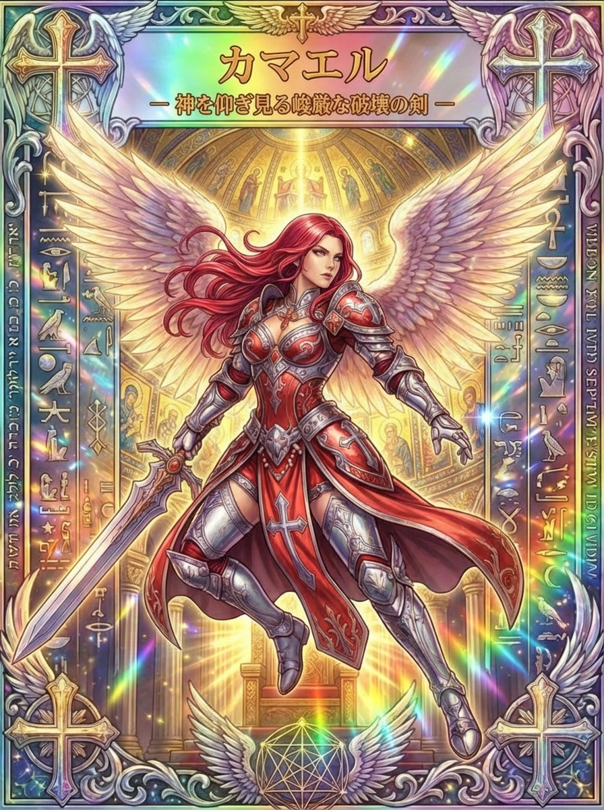

# カマエル、厳しさと勇気を映す剣の天使

何かを変えたいのに、考えているうちに一日が終わってしまうことがあります。カマエルのカードにある赤い鎧と大きな剣は、そんな時に、自分の力をどこへ向けるかを考えさせる姿です。

強さを、迷わないことや恐れないことだけで測らなくてもよいのです。カマエルの背景にある厳しさを知り、選ぶこと、断ること、必要な一歩を踏み出すことへ、その象徴をつないでみましょう。

## カマエルとは？力と厳正さに関わる天使

<figure class="niji-kami-card-figure">

</figure>

カマエルはCamaelなどと綴られ、西洋の神秘思想で力や厳正さ、火星と関係づけられる天使です。九階級の能天使と結びつけて説明される場合もありますが、階級や天使の配置は体系によって異なります。

能天使という言葉だけから、誰よりも強い戦士の順位を想像する必要はありません。天使の階級は、単純な戦闘力の順番というより、どのような働きを担うかを捉える枠組みです。

このカードには「神を仰ぎ見る峻厳な破壊の剣」と記されています。「神を見る者」と説明される名の解釈を連想させますが、カードの姿を味わう時は、名前から能力を決めるより、厳しさをどう使うかに目を向けます。

厳しさは、人へ強く当たることだけではありません。守りたい約束がある時に曖昧な返事をやめる、自分に合わない負担を引き受け続けないなど、生活の形をはっきりさせる力にもなります。

カマエルを勇気の象徴として読むなら、勢いだけで全部を壊すより、何を変え、何を守りたいかを選ぶ姿として考えてみましょう。剣の大きさより、剣を向ける先が大切になる一枚です。

## ゲブラーと火星、力を扱うための厳しさ

ルネサンス期の西洋神秘思想では、カマエルはゲブラーと火星に結びつけられています。ゲブラーには力や厳しさ、裁きなどの主題があり、穏やかな慰めだけではない天使像が見えてきます。

そこでは戦いや処罰の意味も含まれます。古い思想の厳しさを、すべて優しい励ましの言葉へ置き換えてしまうと、カマエルが持つ緊張感が薄れてしまいます。

一方で、その厳しさを現代の人間関係へそのまま持ち込む必要はありません。カードの読み解きとしては、力を持つ時に何を基準に使うのか、という問いを受け取れます。

たとえば決定する立場にある人なら、声の大きな人だけの要望を採用せず、目的や条件に沿って選びます。全員の希望を全部かなえることが難しい場面でも、理由を説明する責任は残ります。

自分の予定でも同じです。やりたいことをすべて入れると時間が足りなくなるなら、どれを今行い、どれを後へ回すかを決める必要があります。

この時の厳しさは、自分から楽しみを奪うためではなく、選んだことへ力を使えるようにするためのものです。火星の行動的なイメージを、選択と準備を伴う力として捉えると、日常にも生かしやすくなります。

## サムソンとの結びつき、強さを持つ者の危うさ

西洋神秘思想のカマエルには、怪力で知られるサムソンと関係づけられる姿もあります。これは後世の対応づけであり、士師記の中でカマエルが名乗ってサムソンを助ける場面がある、という意味ではありません。

サムソンの誕生を伝える物語には、両親のもとへ天使が来て、生まれる子について告げる場面があります。その天使の名はカマエルと明記されておらず、名前を尋ねられても、その不思議さを語る応答が描かれます。

成長したサムソンは大きな力を発揮しますが、力があることと、すべてを見通して行動できることは一致しません。デリラへ秘密を明かし、髪を切られ、力を失って捕らえられるという危うさも物語に含まれます。

この人物の話をカマエル本人の武勇伝に移し替えず、力という主題を考える関連の物語として眺めると、単純な強さへの憧れから一歩深く入れます。力を使うには、自分を守る条件を知ることも必要だと考えられます。

日常なら、得意だからと頼まれるままに働き続けると、休む時間や判断する余裕がなくなる場合があります。強みを持っていることを、いつでも無制限に使わなければならない理由にしなくてよいのです。

自分の力を保つために、引き受ける量や相談できる相手を決めることもできます。カマエルの厳しさを、他人へ向ける前に、自分の力を丁寧に扱う基準として考えてみましょう。

## 赤い鎧と下げた剣、動きの中にある制御

カードのカマエルは赤い髪をなびかせ、赤と銀色の鎧を身につけています。白から淡い金色の翼を広げ、金色の光が満ちる建物の中で、動きのある姿を見せています。

片手の剣は画面の左下へ伸び、もう片方の手は開かれています。剣を頭上に振りかぶるのではなく、身体の動きの中で持っているため、力を使う準備と、使い方を選ぶ余地が感じられます。

顔は横方向へ向いており、上部の言葉から想像するように、目がまっすぐ天を見上げているわけではありません。周囲を見ながら進む姿として眺めると、決意と注意深さを同時に読むことができます。

鎧は胸や肩、脚を覆っています。強くなるために傷つきやすさを無視するのではなく、必要な備えをして動くという象徴に見立てられます。

たとえば初めて意見を伝える場なら、言いたいことを短く書き、必要な情報を手元に置いてから話す方法があります。準備をすることは勇気がない証しではなく、勇気を実際の行動へ移す支えです。

赤い衣の動きには勢いがありますが、背景の柱や建物には秩序があります。情熱だけで走り続けるより、支えになる仕組みの中で動く姿として読むと、カマエルらしい力の使い方が見えてきます。

## 「破壊」を、変える部分を選ぶ力として読む

カードの「破壊」という言葉に、怖さや強い解放感を覚えるかもしれません。ここでの暮らしへの読み解きは、何かを傷つけたり、衝動のまま関係を断ったりするためのものではありません。

変えたいものがある時は、まず何が自分を止めているかを小さく分けます。「今の生活を全部やめたい」ほど疲れているなら、予定の量、連絡の多さ、休む時間の不足など、具体的な負担を見てみます。

たとえば仕事自体は続けたいのに、いつでも返事を求められることがつらいのかもしれません。その場合、仕事を手放す前に、連絡へ対応する時間を決めるという変え方があります。

また、勉強が進まないなら、学ぶことが嫌いなのではなく、最初から長時間を確保しようとしているのかもしれません。五分で終えられる入り口へ変えるだけでも、始める条件を見直せます。

剣で切り分けるのは、自分の価値と、うまくいっていないやり方です。「続かない私はだめだ」と一つにせず、続けにくい条件を選んで変える方が、次の試みへつながります。

<strong>変えるべき部分を絞ると、守りたいものまで壊さずに動けます。</strong>大きな決断ほど、その前に小さく試せる変更がないかを考えてみましょう。

## 怒りを感じた時、守りたいものを言葉にする

怒りが強い時、すぐ行動できる力が湧くことがあります。けれど、その勢いで言葉を送ると、本当に伝えたかったことより、攻撃的な表現だけが相手に残る場合があります。

カマエルのカードを使うなら、まず剣を持つ手ではなく、開いている方の手へ目を向けます。今すぐ強く返す以外の方法も残されている、と考えるためです。

次に、自分が何を守りたくて怒ったのかを一文にします。時間を大切にしたい、約束を守ってほしい、説明する機会がほしいなど、怒りの奥にある願いを探します。

たとえば作業の追加を突然頼まれたなら、「勝手なことを言わないで」より、「今日の予定では追加分まで終えられないので、どれを優先するか決めたい」と伝えられます。状況と必要な判断が見える言い方です。

怒りがあることを隠す必要はありませんが、相手の人格を決めつける言葉にするかは選べます。伝えたい条件を言葉にしたうえで、必要なら時間を置いて読み直します。

自分に対する怒りも同じように扱えます。約束を守れなかったなら、責め続けることより、何が妨げになったかを確かめ、次に守れる約束の大きさへ調整する方が、意志を生かせます。

## 勇気を五分の行動へ変える

「自信がついたら始めよう」と考えていると、準備の終わりが見つからないことがあります。カマエルの行動の主題を使うなら、今の自信のまま試せる小さな範囲を選びます。

応募が怖いなら、いきなり送信する前に、必要な項目を確認するところから始められます。相談を申し込みたいなら、何を聞きたいかを三行にまとめるだけでも、次の行動の形が見えてきます。

五分で終える時は、その短さを軽く扱わないことも大切です。「これしかできなかった」ではなく、前には手をつけていなかった部分がどこまで進んだかを言葉にします。

終わる前に、次の一歩も具体的に残します。「続きを頑張る」より、「書き出した三行を読み直す」「必要な日程を確認する」と書く方が、再開する時の迷いが少なくなります。

小さく試して合わないと分かったら、方法を変えてよいのです。勇気を出した選択だから最後まで変えてはいけない、と考えると、行動が新しい拘束になってしまいます。

行動の価値は、いつも成功したかどうかだけでは測れません。試したことで条件が分かり、次の選択を具体的にできたなら、その一歩は判断の材料を増やしています。

## 決断する時、勢いと条件を一緒に見る

何かを選ぶ場面では、心が強く動くことと、生活の条件が合うことを一緒に見ます。カマエルの赤い勢いを、確認を省く理由にしないための考え方です。

まず、守りたい条件を二つか三つに絞ります。時間、費用、家族との予定など、今の生活にとって欠かせないものを先に言葉にしておきます。

次に、選択肢ごとに何が満たされ、何が難しいかを比べます。全部が理想通りの案がなくても、どこを調整すれば取り組めるかが見えると、ただ迷い続ける状態から進めます。

たとえば新しい学びを始めるなら、内容への興味だけでなく、受講時間を実際に確保できるかを考えます。始めた後の生活を一週間だけ想像すると、必要な準備が具体的になります。

決める日を置く場合も、情報がそろっていないまま自分を追い込む締切にしなくてよいのです。その日までに何を確認するかを決めておけば、待つ時間を準備のために使えます。

また、試せる範囲があるなら、戻れる小さな選択から始める方法もあります。一度の決断で人生全部を証明しようとせず、選んだ後にも見直せる余地を残します。

選ぶ前に、何が分かったら続け方を見直すかを決める方法もあります。たとえば予定していた時間を何度も超えるなら、作業を減らすか、別の日へ分けるといった調整の基準です。

その基準があれば、止まることを単なる負けと考えずに済みます。選んだ目的を守るために手段を変えることも、カマエルの厳正さを生かした判断として捉えられます。

反対に、少し怖くなっただけで毎回すべてを取り消してしまうなら、何が実際の問題で、何が慣れないことへの不安なのかを分けます。問題がまだ起きていない部分は、小さな範囲で試しながら確かめる余地があります。

決断の後に残す記録も、正しかったか間違っていたかの二択だけにしません。何を重視して選び、何が予想と違ったかを書いておくと、次に同じ場面が来た時の判断に使えます。

剣を構えた姿は、毎回同じ方向へ力を振り続ける姿とは限りません。周囲へ目を向け、今の条件に合う向きを選び直すことまで含めて、力を自分のものにしていけます。

## 断る力と休む力、鎧が守るもの

勇気というと前へ出る行動を想像しやすいものですが、断ることにも力が要ります。相手の期待を感じながら、自分の限界や都合を言葉にするのは、簡単ではない場合があります。

カードの鎧を、自分の大切な時間を守る境界として思い浮かべてみます。引き受ける前に、どのくらい時間がかかるか、今ある予定と両立できるかを確かめます。

断る文は、長い言い訳を重ねなくてもよいのです。「今週は対応が難しいです」「この範囲までならできます」と、自分が実際に守れることを伝えます。

相手が残念そうにしていても、それだけで自分の判断が間違いだったとは限りません。相手の希望を理解することと、希望をすべて引き受けることは別の行動です。

休む時も、何も生み出していないと責めるより、使ってきた力を見直す時間として考えられます。予定を入れない夜を残す、終わりの時刻を決めるなど、具体的な形にすると守りやすくなります。

鎧は力を閉じ込めるものではなく、必要な場面で使えるように守るものです。いつも強く見せるために頑張り続けるより、自分が続けたいことへ力を残す選び方をしてみましょう。

## 赤い色と祈り、決めたことを思い出す目印

赤い小物をカマエルのイメージとして使うなら、自分が決めた一つの行動を思い出す目印にできます。色を身につけたことで力が保証されるという意味ではなく、選んだ方向へ注意を戻す工夫です。

たとえば赤いしおりを、取り組む頁へ挟んでおきます。次に開いた時に「ここを五分読む」と分かれば、象徴が具体的な行動とつながります。

祈りとして言葉を添えるなら、「カマエル、守りたいものを見失わず、必要な一歩を選ぶ勇気を持てますように」と呼びかけられます。これはカードを用いた創作の祈りで、伝統的な魔術の作法ではありません。

その後は、気持ちが十分に高まったかを確かめ続けず、決めていた小さな作業へ移ります。静かな気持ちのまま始める日があっても、行動の意味はなくなりません。

言葉を強く唱えることより、その後に何をするかを小さく具体的にしておきます。終えたら次の作業を残し、今日はここまでと区切るところまでを、一つの実践にできます。

## カマエルが出た日、剣を向ける先を選ぶ

仕事について引いたなら、曖昧なまま引き受けていることがないかを見ます。担当や締切を確認する、優先順位を聞くという行動にも、カマエルのはっきりさせる力を重ねられます。

人間関係で引いたなら、相手を変えるための強い言葉より、自分が守りたい条件を言葉にします。何に応じられ、何には応じられないかが伝わると、関係の形を考え直す材料になります。

新しい挑戦で引いたなら、最初の行動を小さく切り出します。怖さが消えるまで待つ代わりに、今の自分でも確かめられる範囲を試し、その結果を次の選択へ使えます。

カマエルの剣は、あらゆるものを敵にするための象徴にしなくてよいのです。守るものと変えるものを選び、必要な場面に自分の力を使う、その決意を静かに支える一枚として向き合ってみましょう。
