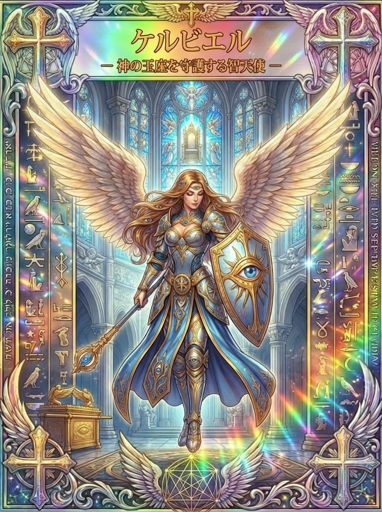

# ケルビエルとはどんな天使？智天使を率いる守りの役割を解説

大切な人や居場所を守りたいのに、気を張り続けて疲れてしまうことはありませんか。ケルビエルは、ユダヤの神秘文書に名を残す智天使（ケルビム）の長で、「何を守るか」を見きわめる天使として語られてきました。

この記事では、ケルビエルとはどんな天使なのか、その由来と伝承、得意分野とされること、開運の習慣までを、やさしい日本語で整理します。資料が限られる天使のため、分かっていることと、カードからの編集上の読み解きを分けてお伝えします。

## ケルビエルとはどんな天使？智天使を率いる存在

<figure class="niji-kami-card-figure">
  
</figure>

ケルビエルは、英語でCherubiel、またはKerubielと表記される天使です。読み方は「ケルビエル」または「ケルビエール」。日本語の資料では、Cherubielの音写「ケルビエル」が一般的に使われています。ユダヤの神秘思想の文書『第三エノク書』に登場し、天上のケルビム（智天使）を率いる長として描かれています。

「ケルビム」は本来、複数の天上の存在を指す集合的な呼び名です。ケルビエルは、その集団の働きを整え、指揮する一人の名前として登場する点が特徴です。

天使に階級があるとする考え方（九階級説）は、6世紀ごろに成立したとされる文書『天上位階論』（偽ディオニュシオス文書）に由来します。そこでは智天使（ケルビム）は熾天使に次ぐ高い位置に置かれますが、これはギリシア語圏のキリスト教の伝統によるもので、ヘブライ語で書かれた『第三エノク書』のケルビエルとは、成立した時代も文化圏も異なります。この階級づけはケルビムという集団の位置づけであり、ケルビエル個人の物語とは由来が異なる点に注意が必要です。

『第三エノク書』では、ケルビエルはケルビムの戦車（メルカバー）を任され、配下の冠を美しく整え、賛美の声を高める役割も担うとされます。戦う存在というより、秩序と調和を整える存在として描かれているのが特徴です。

名前の由来については、「ケルビム」という集合名詞に、天使の名前に多い語尾「エル（神を意味する語）」が加わった形と説明されることが多く、「神に属するケルブ（ケルビムの一柱）」というような成り立ちで理解されます。名前自体に、「集団を率いる者」という意味が込められているわけではありません。

守護者と聞くと、敵を退ける戦士をまず思い浮かべるかもしれません。しかし『第三エノク書』のケルビエルの仕事は、戦うことだけに留まりません。それぞれの配下が自分の役目を果たし、全体として調和するように整える働きまで含まれているのが、この天使の特徴です。

> **ざっくり言うと**
>
> - ケルビエルは、『第三エノク書』に登場する智天使（ケルビム）の長
> - 役割は、天上の秩序を整え、配下をまとめること
> - 象徴は、盾・目・黄金の箱と結びつけて語られる
> - 得意分野は「守護・境界線・信頼」と相性がよい
> - 資料が少ない天使のため、多くはカードからの編集上の読み解き

## ケルビエルの姿と、色・持ち物の象徴

『第三エノク書』のケルビエルは、七つの天の広がりにたとえられる巨大な姿で、無数の目と炎のような輝きを持つとされます。人間と同じ姿の穏やかな人物としてではなく、圧倒的な威厳を持つ存在として描かれているのが特徴です。

体が無数の目で満たされているという描写は、ケルビエル一人だけの特徴ではありません。後の伝承・逸話の章で見る『エゼキエル書』のケルビムの描写にも通じるもので、「見張る」「見落とさない」というケルビム全体に共通するイメージのあらわれと考えられます。

性別については、天使は本来、人間のような肉体的な性別を持たない霊的な存在という考え方が一般的です。ケルビエルも、力強さと威厳を強調して語られることが多いものの、性別を断定する伝統的な決まりはありません。

色や石について、ケルビエルに特定の色や石を結びつける確立した伝承は見当たりません。このシリーズのカードでは、盾に青、鎧に金を配していますが、これは資料に基づく伝統ではなく、絵の中の表現です。お守りを選ぶなら、伝承にこだわらず、自分が落ち着ける色や石を選んで問題ありません。

持ち物として重ねられるのは、盾と目の象徴です。ケルビムは古くから「見張る者」「守る者」のイメージと結びついており、これは次の伝承・逸話の章で詳しく見ていきます。

## ケルビムの伝承・逸話に見る、守りの意味

ケルビエル個人の逸話は限られていますが、彼が率いるケルビムは、聖書のいくつもの場面に登場します。ここでは、ケルビム全体の伝承と、ケルビエルが率いる存在としての背景を分けて紹介します。

- 『第三エノク書』：ケルビエルは智天使の長として、天上の戦車の働きを整え、配下の冠を美しくし、賛美を高める役割を担う
- 『創世記』：人間がエデンの園を去った後、命の木へ至る道を守るため、ケルビムと回転する炎の剣が置かれる。ここでは個人名は示されない
- 『出エジプト記』：契約の箱（アーク）の覆いの両端に、金で作った二体のケルビムを向かい合わせに置くよう語られる。翼の間の空間が、神とモーセの語り合う場所とされる
- 『エゼキエル書』：四つの顔（人・獅子・牛・鷲）と車輪を持つ生き物が現れ、後の章でケルビムであると明かされる。多方向に開かれた力強い存在として描かれる
- 『列王記』：ソロモンが建てたエルサレム神殿の至聖所に、オリーブ材でできた高さ約10キュビト（諸説あるが数メートル規模）の巨大なケルビム像が二体安置されたと記される

これらの場面に共通するのは、ケルビムが「境界」や「大切なものの近く」に置かれる存在だということです。エデンの園の出入り口、契約の箱の上、神の栄光のそば。いずれも、守るべきものと、そのそばに立つ役割が重なっています。

『創世記』のケルビムは、人間を遠ざける門番のようにも見えますが、そこにあるのは単純な排除ではありません。聖なる場所と人が行き交う道の境界に立つことで、「何をどう扱うべきか」を考えさせる存在として描かれています。

『出エジプト記』の場面で印象的なのは、ケルビムだけが主役になっていない点です。翼と翼の間に守られた空間があり、そこに納められる契約と、そこから伝えられる言葉のほうに、より大きな意味が置かれています。

『エゼキエル書』のケルビムは、一つの見方だけで結論を急がない知恵にもつながります。人や獅子、牛、鷲という異なる顔を同時に持つ姿は、ものごとを一方向からだけで判断しない構えを象徴していると読むこともできます。

『列王記』のソロモン神殿の巨大なケルビム像も、契約の箱の小さな二体のケルビムとは別に語られる場面です。どちらも「もっとも神聖な空間のそば」にケルビムが置かれるという共通点があり、単なる装飾ではなく、聖なるものの守り手として位置づけられていたことがうかがえます。

面白いのは、ケルビエル自身の役割が、ただ立ちふさがることだけではない点です。配下の冠を整え、賛美の声を高めるという仕事は、守ることと、整えて輝かせることが、もともと一つながりであると教えてくれます。

## 守りと境界線を後押しする、ケルビエルの得意分野

ケルビエルの得意分野として意識したいのは、<strong>守護・境界線・信頼</strong>です。これは聖書や『第三エノク書』の伝承から、このシリーズが編集上読み解いたテーマであり、公式に定められた「ご利益」ではありません。

- 守護：大切な人や場所、時間を守りたい時に心を向けたいテーマ
- 境界線：頼まれごとを何でも引き受けず、自分の範囲を決めたい時に合う
- 信頼：約束や役割を分担し、一人で抱え込みすぎないようにしたい時に向く
- 秩序：散らかった状況や予定を整理し、落ち着きを取り戻したい時の支えになる

大切なのは、「守ってもらって終わり」ではなく、何を守りたいのかを自分の言葉で決めることです。ケルビエルに心を向けるなら、守りたいものを一つに絞り、そのための小さな行動を決めてみましょう。

たとえば、家族との時間を守りたいなら、「夕食の最初の十五分は仕事の連絡を見ない」と具体的に決めます。頼まれごとを断りたいなら、「今日は難しいですが、金曜なら対応できます」と代案を用意する方法もあります。こうした小さな線引きが、ケルビエルの守りのテーマと重なります。

## 今日からできる、ケルビエル流の開運習慣

ケルビエルの開運は、特別な道具がなくても始められます。守るべきものと、境界線を整えることから始めてみましょう。

| 開運アクション | 意味 | おすすめの人 |
|---|---|---|
| 今週いちばん守りたいものを一つ決める | 優先順位をはっきりさせる | あれもこれも気にかかる人 |
| 断りたい頼みごとに、丁寧に線を引く | 自分を守る境界線をつくる | 我慢しがちな人 |
| 家族や仲間と予定を共有する場所をつくる | 一人で抱え込まない仕組みをつくる | 頼られすぎている人 |
| 青や金など、落ち着く色を身近に置く | 意識を切り替えるスイッチにする | 気持ちを整えたい人 |

※色については伝統的な決まりがなく、このシリーズの編集上の解釈です。しっくりくる色を選んで問題ありません。

## ケルビエルがついている人の特徴とサイン

「ケルビエルがついている人」と断定できる基準はありませんが、次のような感覚がある人は、守護と境界線のテーマを暮らしに取り入れてみるとよいでしょう。

- 大切な人や場所を、もっとしっかり守りたいと感じている
- 頼まれると断れず、疲れがたまっている
- 何をどこまで自分が引き受けるべきか、迷っている
- 目や盾のモチーフに、なぜか心が引かれる
- 「ケルビム」「智天使」という言葉が、最近気になる

よく言われるサインの例

- エンジェルナンバー：ケルビエルと結びつけられる特定の数字は、資料によって違いがあり、決まった正解はありません
- 夢：盾や光る目、翼の姿が印象に残る夢を、守りのメッセージと受け取る人もいます

サインは受け取る人の感じ方しだいです。来ないからといって、守られていないという意味ではありません。ひとつでも当てはまるなら、守りたいものを一つ言葉にし、境界線を引く行動を小さく試してみてください。

## ケルビエルゆかりの場所・作品

ケルビエルという個人名で特定できる聖地や教会は、現時点で確認できていません。ケルビムそのものは、聖書に記された古代のエルサレム神殿の至聖所や契約の箱の装飾、各地の教会建築の彫刻モチーフとして広く用いられてきましたが、ケルビエル個人に結びつく固有の巡礼地として紹介するのは難しい状況です。

出典として広く知られる『第三エノク書』は、ユダヤ神秘主義（メルカバー神秘主義）の写本として伝わる文書で、教会や美術館のような一般公開の聖地は基本的にありません。研究者の翻訳や解説を通じて内容が知られてきた文書です。

このシリーズのカードは、目・盾・黄金の箱といった象徴を通じて、ケルビエルを現代の創作として表現しています。実在の聖地を訪ねるより、身近な場所で「守りたいもの」を確かめる時間として楽しむのに向いた天使です。公園や図書館などの日常の場所を、無理に固有の聖地として扱う必要もありません。

作品としては、ケルビムを彫刻や絵画のモチーフとして取り入れた教会建築や宗教美術が各地に残っていますが、それらの多くは「ケルビム」という集合的な存在の表現であり、ケルビエルという固有の名前を掲げた作品として紹介できるものではありません。この記事では、確認できない結びつきを無理に断定せず、ケルビム全体の伝承として整理しています。

## ケルビエルへの祈り方と、短い振り返り

ここで紹介するのは、ケルビエルの伝承に着想したこのシリーズ独自の振り返りです。伝統的な祈祷文の再現ではなく、大事にしたいものと、自分にできる行動を確かめる時間として取り入れてください。

- 今日、いちばん守りたいものを一つ思い浮かべる
- その周りに必要な余白や境界を、心の中で置く
- 「大切なものを大切に扱えるよう、できることを一つ選びます」と短く言葉にする
- 終えたあと、すぐできる行動を一つ決めて実行する
- 帰り道や寝る前に、気づいたことを短くメモに残す

1分でできる、守りの振り返り

1. 静かな場所で座り、ゆっくり深呼吸を3回する
2. 今日守りたいものを一つ、心の中で言葉にする
3. その周りに必要な境界線を、やさしくイメージする
4. 「今日はこの一歩を守る」と、小さな行動を一つ心に置く
5. 目を開けて、肩の力を抜く

※気持ちを整える目的のイメージ法です。強い不安が長く続く時は、無理せず専門の窓口に相談してください。

## オラクルカードでケルビエルが出た時のメッセージ

オラクルカードでケルビエルが出た時、このシリーズで読み解くメッセージは、次のようなものです。

- 守られている：気づかないところで、支えてくれる人や仕組みがある
- 境界線を引く時：何でも引き受けず、自分の範囲を決めるタイミング
- 信頼して任せる：一人で抱え込まず、役割を分けてよい
- 見落としを確かめる：まだ聞いていないこと、確認していないことがないか振り返る

カードの意味は、デッキや読み手によって違います。ここに書いたのは一般的な読み方のひとつです。カードが出た時は、今抱えていることのうち、「自分が守るべきこと」を一つ、「人に任せてよいこと」を一つ選んでみましょう。

## おわりに｜守りたいものを、一つに絞る

ケルビエルは、『第三エノク書』に登場する智天使の長として伝えられ、守護・境界線・信頼を願う人にとって心強い存在です。資料は多くありませんが、聖書のケルビムの伝承とあわせて眺めると、守ることと整えることが一つながりであると気づかされます。大きな戦いの物語ではなく、身近な境界線を一つ決めるところから、ケルビエルの開運は始まります。まずは今日、守りたいものを一つに絞ることから始めてみましょう。
