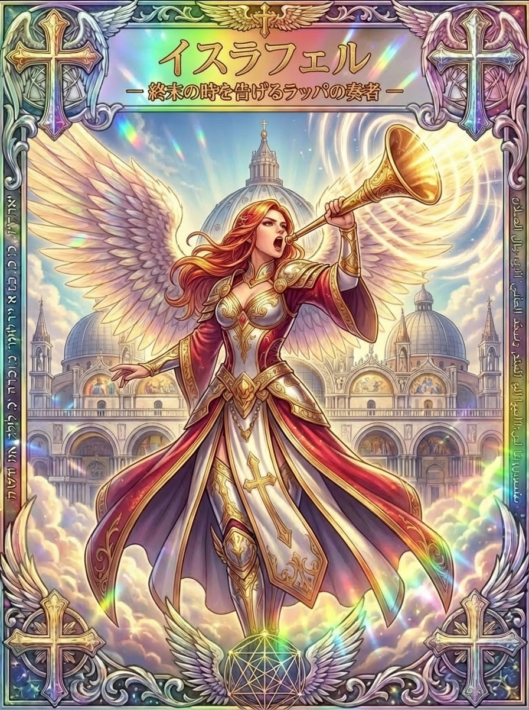

# イスラフェルとはどんな天使？名前の意味とラッパの伝承を解説

何かを終えたのに、気持ちだけが次へ進めないことがあります。反対に、新しく始めたいことがあっても、区切りがつかず日々が過ぎていく場合もあるでしょう。

大きなラッパを掲げるイスラフェルのカードは、そんな時に「何を閉じ、何を始めたいのか」を考える入口になります。この記事では、イスラフェルとはどんな天使とされてきたのか、名前の意味とイスラム教における役割、写本に残る姿、そして文学に描かれた声を確認しながら、同じ名前に重なる表現を混同せずに紹介します。

## イスラフェルとはどんな天使？名前の意味とイスラーフィールとしての役割

<figure class="niji-kami-card-figure">

</figure>

イスラフェルは、イスラム教の伝承でイスラーフィールと呼ばれる天使に結びつく名前です。英字ではIsrafilやIsrafelなどの表記があり、日本語でもイスラフィルなどと書かれます。名前の意味を一つに確定する資料はありませんが、終末のラッパ、または角笛を吹く役割で広く知られています。音楽会の演奏者というより、神の命令のもとで世界の重大な転換を告げる存在として理解されます。

イスラーフィールという名前は、預言者の言行を伝えるハディース集の一つ、『サヒーフ・ムスリム』にも現れます。夜の礼拝において、ジブリール、ミーカーイール、イスラーフィールの主である神へ呼びかける祈りが伝えられている一節です。この祈りの宛先は天使自身ではなく神です。天使の名前が登場することと、天使に直接願いをかなえてもらう実践とは区別すると、イスラム教の背景を理解しやすくなります。

> <strong>ざっくり言うと</strong>
>
> - イスラフェルは、イスラム教の伝承でイスラーフィールと呼ばれる天使
> - 中心的な役割は、終末のラッパ・角笛を吹くこと
> - クルアーン第39章68節にラッパの場面があるが、吹き手の固有名は記されていない
> - 詩人エドガー・アラン・ポーの作品にも、美しい歌声の天使として登場する
> - このカードの主題は「終わりと始まりの区切り」

## 姿・性別・色・石について

イスラフェルについて、伝承上の姿や性別、決まった色や石を一律に示す資料は確認できていません。ここでは分かっている範囲だけをまとめます。

<strong>姿</strong>：このシリーズのカードでは、大きなラッパを掲げ、光の輪を広げる人物として描かれています。ラッパは、合図を届ける役割の象徴として読めます。古い写本にもラッパを吹くイスラーフィールの姿が残されており、後述します。

<strong>性別</strong>：資料上、決まった性別を示す記述はありません。天使に人間のような性別はないとする考え方もあり、この記事でもどちらかに断定しません。

<strong>色・石</strong>：イスラフェルに定まった守護色やパワーストーンを示す資料は見当たりません。カードの赤と金は、このカードの表現として受け取り、身につける色は自分がしっくりくるものを選んで大丈夫です。

## クルアーンのラッパは、何を告げるのか

クルアーン第39章68節には、ラッパが吹かれると天と地にいる者が倒れ、神が望む者は除かれること、再び吹かれると彼らが立ち上がることが語られます。この節には吹き手の固有名は記されていません。

そのため、「クルアーンにイスラフェルの名前と役職がすべて書かれている」とまとめると、本文と伝承の違いが見えなくなります。ラッパの場面と、名を持つ天使としてのイスラーフィールを、重なりのある別の層として捉えることが大切です。この節では二度の吹奏が描かれますが、終末全体の出来事をどう整理するかには伝承や解釈の広がりがあり、すべてを「必ず二回だけ」という一文にそろえることはしません。

日常の「再出発」という主題へ重ねる場合は、そこから受けた象徴的な読み解きになります。人生の転機や仕事の節目を、そのまま宗教上の終末と同じ出来事にするのではなく、区切りを大切にする視点を借りる形です。

## 写本に描かれた、ラッパを吹くイスラーフィール

イスラーフィールの姿は、古い写本の挿絵にも残されています。ロンドンの大英博物館には、カズウィーニーの『被造物の驚異』に由来する、ラッパを吹く天使を描いた一葉が所蔵されています。博物館の作品情報では、制作地はバグダード、年代は1375〜1425年とされています。裏面の文章にも審判の日の角笛にかかわる記述があり、天使の役割と絵が結びついています。

| 資料 | 特徴 | 制作地・年代 |
|---|---|---|
| カズウィーニー『被造物の驚異』所収の一葉（大英博物館蔵） | ラッパを吹くイスラーフィールを描いた挿絵。裏面に審判の日の角笛に関する記述 | バグダード、1375〜1425年頃 |

この作例から、ラッパを吹くイスラーフィールが絵画表現の題材にもなってきたことが分かります。歴史のある図像を見る楽しさは、現在のイメージと似ている部分だけを探すことではなく、どんな時代の人が重要な役割をどのような姿へ置き換えたのかを考えるところにもあります。

## 守護と得意分野｜終わりと始まりの区切りを整える

イスラフェルの得意分野として、このカードと資料から読み取れるのは次のようなテーマです。

- 区切りをつける：終わったことと、まだ残っていることを分けたい時
- 始まりの合図：始めたい気持ちがあるのに動けない時、最初の動作を具体的にしたい時
- 声にする：黙っていたことを、短く整えて伝えたい時
- 受け取る：立派な言葉でなくても、自分の言葉を大切にしたい時
- 一点集中：一つの合図に多くを結びつけすぎず、最初の一つだけを決めたい時

区切りをつけるというと、過去を忘れて前向きになることを思い浮かべるかもしれません。けれども、終わりには達成感だけでなく、寂しさや未練、やり残した思いが混ざることがあります。仕事や学びの節目では、まず「終わったもの」と「まだ残っているもの」を分けてみます。作業は終わっていても、連絡や片づけ、お礼を伝えることが残っていると、気持ちの区切りがつきにくい場合があります。次の始まりに持っていくものは、自分で選べます。経験のすべてを否定することも、美しい思い出に整えることもせず、残したい学びを一つ手元に置くという形です。

## 今日からできる、イスラフェル流の開運習慣

イスラフェルの開運は、「終わったこと」と「始めたいこと」を具体的な行動に分けることから始まります。

| 開運アクション | 意味 | おすすめの人 |
|---|---|---|
| 終わった物事の、残っている連絡や片づけを一つ済ませる | 気持ちの区切りをつけやすくする | やり残しが気になって次へ進めない人 |
| 始めたい作業の「最初の一段落・一動作」だけ決める | 始める場面を具体的にする | 決意はあるのに動けない人 |
| 一つの合図（音や場所）を、始める時の目印にする | 始まる時をはっきりさせる | 習慣が続きにくい人 |
| 信頼できる一人に、今月試したいことを伝える | 声にすることで区切りをつける | 一人で抱え込みやすい人 |
| 伝えた後、聞き手の受け取り方を一度確かめる | 伝えるだけで終えない | 行き違いが起きやすい人 |

## イスラフェルがついている人の特徴と、気づきやすいサイン

イスラフェルが気になる時は、今の自分が「区切り」を必要としているサインかもしれません。断定はできませんが、次のような感覚がある人は、このカードのテーマを暮らしに取り入れてみるとよいでしょう。

- 何かを終えたのに、気持ちが切り替わらない
- 始めたい気持ちはあるのに、最初の一歩が分からない
- 言いたいことを飲み込んで、伝えられずにいる
- 節目や記念日に、変わったことと変わらないことを考えたくなる
- ラッパや、光が広がる場面のイラストに心が引かれる

<strong>よく言われるサインの例</strong>

- エンジェルナンバー：イスラフェルに結びつけられる特定の数字は、資料によって決まった説がなく、この記事では特定しません
- 夢：ラッパの音や、光に包まれる場面が夢に出てきたことを、このカードと結びつけて受け取る人もいます
- 目に入るもの：ラッパや、光の輪のモチーフなどが続けて目に入る

サインは受け取る人の感じ方しだいです。たまたま聞こえた音楽やラッパの音を重大な決断の命令にするより、決めかねていた事柄を落ち着いて見直すきっかけにする程度がちょうどよい付き合い方です。

始めたい気持ちがあるのに動けない時は、決意が足りないと責める前に、最初の動作が曖昧になっていないかを見てみます。「勉強する」と「机に本を開き、一段落読む」では、始める場面の具体性が違います。音を使うなら、短い曲の終わりに机へ向かう、タイマーが鳴ったら一つの準備をするなど、自分で決められる合図にできます。音が苦手な人は、机の上に道具を置く、予定表へ印をつけるといった目で分かる合図でも構いません。

## ポーの詩に現れる、美しい声のイスラフェル

エドガー・アラン・ポーの詩『イスラフェル』では、天使は卓越した歌声を持つ存在として描かれます。天の星々がその声に聞き入り、地上に生きる語り手は、自分と天使の表現の違いを見つめます。ここで中心になるのは終末の角笛ではなく、声と詩の想像力です。天使のいる世界と、人間が喜びや苦しみの両方を経験する世界が対比され、最後には立場を交換したらどんな歌が生まれるかという問いへ進みます。

なお、詩の冒頭に掲げられた言葉を、そのままクルアーン本文の引用として紹介するのは適切ではありません。ポー研究では、セールによるクルアーン訳の序論と、それを参照したムーアの作品との関係が指摘されています。「最も美しい声」というイメージを知る時も、どの表現世界に属する言葉かが大切です。詩の魅力として声を味わうことと、信仰上の役職を説明することは、それぞれに楽しみ方があります。

天上の声への憧れは、地上の声を無価値にするためのものではないと読むこともできます。限られた場所や条件の中だからこそ出てくる言葉があるという視点は、創作や発信をする人にも響くでしょう。今日伝えたいことが一つあるなら、それを自分の言葉で短く表すところから始めてもよいのです。

## イスラフェルへの祈り方と、短い振り返り

ここで紹介する振り返りは、このカードから考えた独自の実践例です。イスラム教の礼拝や伝統的な祈祷を再現するものではありません。

- 今閉じたいことを一つ、始めたいことを一つ書く
- 閉じたいことには、必要な連絡や片づけが残っていないかを添える
- 始めたいことには、明日できる最初の動作を一つだけ書く
- 短い言葉にする（例：「終えた時間を大切にしながら、次の一歩を選べますように」）

<strong>1分でできる、光の輪をイメージする振り返り</strong>

1. 静かな場所で座り、ゆっくり深呼吸を3回する
2. ラッパの開口部から光の輪が静かに広がっていく様子を思い浮かべる
3. 今の自分が終えたいこと、始めたいことをそれぞれ一つ心の中で言葉にする
4. 「今日はこの一歩を進める」と、小さな行動を一つ心に置く
5. 目を開けて、肩の力を抜く

※気持ちを整える目的のイメージ法です。

## オラクルカードでイスラフェルが出た時のメッセージ

このシリーズのイスラフェルが出た時、カードの主題から読める一般的なメッセージは次のようなものです。

- 区切りの時：何を終え、何を始めたいのかを整理するタイミング
- 合図を出す：始める時をはっきりさせる、具体的な動作を決める
- 声にする：黙っていたことを、短く整えて伝える
- 自分の言葉を大切に：立派さより、自分が伝えたい感覚に近いかを確かめる

カードの意味は、デッキや読み手によって違います。ここに書いたのは、このシリーズのカードに基づく一つの読み方です。カードが出た時は、「何を終え、何を始めるか」を一つずつ選んでみましょう。

ラッパのカードは、黙っていたことを言葉にするきっかけにもできます。ただし、勢いで強い言葉を相手にぶつけるより、自分が伝えたい内容を短く整えるほうが、意図が届く場合があります。相談なら、「少し困っています」に続けて、何について助けがほしいかを一つ添えてみます。声の大きさや流暢さだけで、自分の言葉の価値を測らないでください。話すのが難しければ文章で伝える、要点を手元に置いて読むなど、自分に合う届け方を選べます。

## おわりに｜今日の一文を、自分の声で

イスラフェルのラッパには宗教の厳粛な背景があり、詩には声の想像力があり、このシリーズのカードには区切りを見つめる表現があります。その違いを大切にしながら、今の自分が届けたい一文を選んでみてください。
