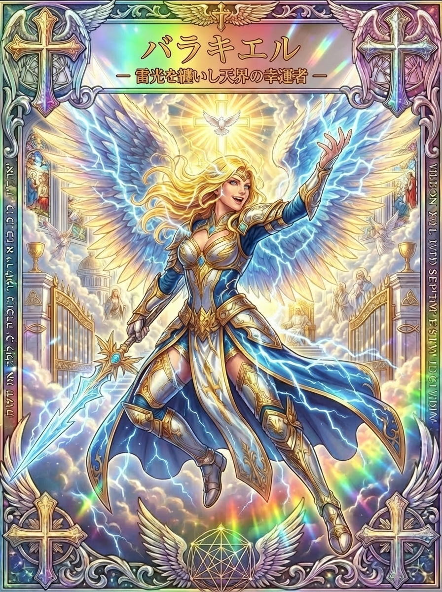

# バラキエル、雷光のカードに映るひらめきと変化

行き詰まっていた考えが、ふと別の角度から見えることがあります。けれども、そのひらめきを形にする前に忘れてしまったり、勢いだけで動いて後から迷ったりすることもあるでしょう。

青白い雷光をまとうバラキエルのカードは、瞬間の気づきと、その後の行動を考える題材になります。剣を持ちながら笑みを浮かべ、開いた門の前で腕を伸ばす姿が印象的です。

このシリーズでは「祝福」のバラキエルと「雷光」のバラキエルを別のカードとして扱っています。名前の似た伝承を一つにまとめず、雷光の一枚に描かれた変化の力を見ていきましょう。

## バラキエル（雷光）とは？稲妻を中心にした天使像

<figure class="niji-kami-card-figure">

</figure>

このカードのバラキエルは、稲妻とひらめきに結びつく天使として描かれています。Baraqielという表記に関連して、ヘブライ語の「稲妻」を意味する語が知られ、「神の稲妻」という説明につながります。

ただし、雷光に関連する名前があることと、このカードに描かれた役割のすべてが古くから共通していたことは別です。「天界の幸運者」という副題は、まずこのカードの表現として受け取ります。

名前をたどると、第一エノクに現れるバラキジャルという存在にも行き当たります。そこでは地上へ降りた見張りの天使たちの一人として登場し、明るい幸運の守護者とは異なる文脈に置かれています。

この違いは、単純な善悪の二面性として一人の性格へまとめるより、異なる物語や表現があると理解すると混乱しません。古い物語の行動を、そのままカードの天使に背負わせる必要はないのです。

雷光の一枚を暮らしで読む時には、暗い場所を一瞬照らす光を「見えていなかった点に気づくこと」へ重ねられます。未来が一気に好転する保証ではなく、今までの考えを見直す入口にしてみましょう。

## 第一エノクのバラキジャルは、どんな場面にいるのか

第一エノク第6章では、天上の存在たちが人間の女性を妻にしようと決め、誓いを交わして地上へ降りる物語が語られます。ヘルモン山への下降と結びつく集団の長たちの名簿に、バラキジャルに当たる名が含まれます。

続く第8章では、人間へ教えられたさまざまな知識が挙げられ、バラキジャルには占星術に相当する教えが結びつけられています。この場面は、天から知識を授かって皆が幸せになったという単純な物語ではありません。

物語の中では、授けられた知識と地上の乱れが結びつけられます。知っていることや力があることだけで、使い方まで正しいとは限らないという緊張を持った場面です。

ここに、現代の「ひらめき」を考える時にも響く問いがあります。よい案を思いついた時、その新しさだけでなく、実際に使うと誰にどう影響するかを考える必要があるということです。

この問いは物語から受け取れる読み方であり、バラキジャルが現代の人へ仕事術を教えたという意味ではありません。古い物語が持つ知識と責任の主題を、今の生活に照らして考えるという距離を保ちます。

たとえば人の注目を集める発信を思いついたとしても、関係者の事情や事実を確かめずに公開すれば負担を生むかもしれません。思いつきの強さと、相手に配慮する丁寧さの両方を持つことが、ひらめきを育てる土台になります。

星を読む知識と稲妻の印象には、空を見るという接点がありますが、同じ働きではありません。星の配置を読むという物語の要素から、本人が雷で願いをかなえたという話まで広げないことで、古い物語とカードの表現がそれぞれに残ります。

知識を得ることは、見えなかったものに名前を与えることでもあります。名前がつくと理解した気になりやすいからこそ、実際の出来事を見続けるという姿勢も、雷光の主題へ重ねられます。

## 祝福のバラキエルと混ぜないために

祝福系のBarachielは、キリスト教の一部の伝統で神の祝福を取り次ぐ天使として語られ、白いバラを胸に添える図像も説明されています。花と祝福を中心にした姿は、剣と稲妻を持つ今回のカードとは主題が異なります。

一方、第一エノクのバラキジャルは見張りの天使たちの物語に登場します。同じように聞こえる名前でも、物語の立場、持ち物、語られている働きを一つずつ見ると、違いがはっきりします。

このシリーズの「雷光」と「祝福」という区別は、二枚のカードを取り違えないためにも大切です。祝福系の白いバラや取り次ぎの役割を、雷光のカードの由来としてそのまま加えることはしません。

逆に、雷光系に関連する見張りの天使の話を、祝福のカードが堕天使であるという説明に使うこともできません。名称の近さだけで評価を移すと、どちらの表現も見えにくくなります。

カードの雷光を見て「勢い」を感じ、祝福の花を見て「受け取ること」を感じるなど、絵柄に応じて違う問いを持つことはできます。どちらが強いか、どちらのほうが幸運を呼ぶかを決めるための区分ではありません。

気になる名前を知る楽しみには、一つの答えへ急がず、違う姿を違うものとして眺めることも含まれます。ここでは雷光のカードに戻り、光の走り方や人物の姿勢から読み解きを深めます。

## 剣を下へ向け、開いた手を上げる姿

カードでは、金色の髪をなびかせた人物が、青と金の鎧をまとって宙に浮かんでいます。大きな翼や衣の周りに青白い稲妻が走り、背後には明るい空と開いた門が見えます。

画面左側の手には、光る刃を持つ剣があります。しかし、剣先は目の前の誰かに突きつけられているのではなく、下方へ向けられています。

反対の腕は上へ伸び、手のひらが開かれています。力を持つことと、受け取る余地を残すことが一つの姿に同居していると読むと、単に障害を切り倒すだけのカードではなくなります。

人物の表情には笑みがあり、稲妻の強さに対して、驚きや喜びを感じさせる明るさがあります。ひらめいた瞬間の高揚感を思い出す人もいるでしょう。

開いた門は、まだ知らない選択肢への入口として重ねられます。ただし、門の向こうに何があるかは絵から分からないので、気になる道へ進む前に中身を確かめるという読み方もできます。

背景の聖堂風の建物や人物像、十字の装飾は、この絵の世界を構成する要素です。特定の聖地で起きた奇跡の再現とするより、光が広がる壮大な舞台として味わうと、カードそのものの魅力が伝わります。

## 稲妻のひらめきを、消える前に言葉にする

ひらめきは、完成した答えとして現れるとは限りません。短い言葉、形のイメージ、「この順番を変えたらよさそう」という小さな違和感として浮かぶこともあります。

その時は、整った文章にしようとせず、何を思いついたのかを一行残します。「説明の最初に完成例を見せる」「この二つの作業を同じ日にまとめる」など、後で意味を思い出せる言葉があれば十分です。

あわせて、何がきっかけだったかを書いておくと、後から検討しやすくなります。誰かの質問で気づいたのか、作業が止まった場所から思いついたのかによって、案が解決しようとしている問題が見えてきます。

すぐに実行できない案も、残しておけば失われません。思いついた時間と試す時間を分けると、他の予定を崩さずに、後で落ち着いて向き合えます。

バラキエルの雷光は一瞬の明るさですが、記録はその後も残ります。気分が高まっている時だけ魅力的に感じたのか、翌日見ても役立ちそうかを確かめる材料になります。

「何もひらめかない」と感じる日は、分からないことを一行書く方法もあります。「ここで説明が伝わらない」「この手順に時間がかかる」という問いが、次に気づくための的になります。

記録には、完成案と未整理の断片を分けて置く場所を作ると使いやすくなります。まだ説明できない形や短い言葉は「保留」として残し、後で別の案とつながるかを見てみます。

一週間後に眺めて、同じ問題について何度も書いていることに気づく場合もあるでしょう。それは単発の思いつきではなく、今の自分が取り組みたい課題を表しているかもしれません。

その時は、一番華やかな案より、繰り返し気になっている問題を選ぶ方法があります。雷光のような瞬間と、繰り返される関心の両方を見ることで、自分にとって取り組む価値のある一案を探せます。

## 幸運を「機会に気づくこと」として考える

カードの副題にある幸運を、偶然のよい結果だけで捉えると、何かが起こるのを待ち続けてしまいます。日常に取り入れるなら、目の前にある機会に気づき、確かめることへ置き換えてみましょう。

たとえば以前から気になっていた分野の話を聞ける機会があった時、すぐに大きな成果を期待しなくても構いません。知りたかったことを一つ質問し、今の自分に関係する情報を持ち帰るだけでも次につながります。

偶然出会った情報が、自分にぴったりだと感じることもあるでしょう。その感覚を入口にしながら、日程や内容、必要な負担を確かめれば、勢いを失わずに判断できます。

<strong>ひらめきを大切にすることと、思いついたことを全部実行することは別です。</strong>今使える時間や周囲への影響も含めて選ぶことで、一つの機会を丁寧に扱えます。

また、よい出来事を振り返る時には、それに気づけた自分の準備も見てみてください。以前調べた知識や、誰かと交わしていた会話が、情報を理解する助けになっていた可能性があります。

幸運を自分の手柄だけにする必要も、すべてを天使の働きにする必要もありません。偶然、他者の助け、自分の行動が重なった出来事として眺めると、次に大切にしたい関わり方が見えてきます。

## 流れを変えるなら、まず一か所を試す

停滞している時には、すべてを一度に変えたくなることがあります。仕事の進め方も生活時間も目標も同時に変えると、何が合っていたか分からず、続けるのが難しくなる場合があります。

カードの光る剣を、問題を小さく切り分ける道具として読んでみましょう。「全部うまくいかない」ではなく、どの作業のどの場面で止まるのかを一つ選びます。

文章が書けないなら、テーマが広すぎるのか、最初の一文に迷っているのか、必要な情報がないのかで対応が変わります。テーマなら読者を一人に絞り、一文なら途中の説明から書くなど、試し方を選べます。

連絡が行き違うなら、相手が悪いと決める前に、確認する内容や返事の期限が伝わっているかを見直します。質問を一つずつ分けるだけで、やり取りしやすくなる場合もあります。

試す期間と、見るポイントを決めておくことも役立ちます。「今週はこの順番で行い、迷う時間が減ったかを見る」とすれば、ただ気分で変え続ける状態から離れられます。

うまくいかなければ、元に戻すことも調整の一つです。稲妻のような変化を、大きく壊して作り直すことだけにせず、小さな試行で見通しを得ることへ結びつけてみてください。

## 勢いが出た時ほど、守るものを確かめる

明るい案を思いつくと、今すぐ動かなければ機会を逃すように感じることがあります。その時こそ、変えたいことの隣に、変えたくない大切なものも書いてみます。

たとえば新しい活動を始めたいなら、家族と過ごす時間、睡眠、今ある約束などをどう守るかを考えます。希望と制約を同時に扱うことで、始めた後の負担が見えやすくなります。

人に関係するアイデアなら、その人の同意や都合を確かめる段階を入れます。自分にはよい提案でも、相手にとっては準備が必要かもしれないので、選べる形で伝えることが大切です。

カードの剣が下を向いていることを思い出してください。持っている力をすぐに誰かへ向けず、まず自分の中の課題を整理する姿として受け取ることもできます。

高揚感が落ち着いた後に案を読み返すと、核になる部分だけが残る場合があります。勢いを消してしまうのではなく、続けられる形へ整える時間を置いてみましょう。

現実の雷は危険な自然現象です。雷光の象徴を味わうために屋外で雷を待ったり、天候を守護の合図と考えて安全確認を省いたりせず、カードの絵の中でその迫力を楽しんでください。

他の人と案を育てる時には、最初に「まだ試作の考えです」と伝えてみます。完成した結論として受け取られないようにすると、違う見方を出してもらいやすくなります。

反対意見が出た場合も、光を消されたと考える前に、どの条件を心配しているのかを聞きます。自分には見えなかった負担が分かれば、核になるアイデアを残しながら実行方法を変えられます。

カードの開いた手は、新しい案を受け取るだけでなく、人の意見を聞く余地にも見えます。ひらめきの最初の形を守り切るより、使う人に合う形へ育てることを目指してみましょう。

## バラキエルが出た時、何を問いにするか

このカードを仕事について引いたなら、「ひらめきを形にするために、今足りない一つは何か」と尋ねられます。材料なのか、確認する相手なのか、試す時間なのかが分かれば、動作を決められます。

対人関係なら、突然の気づきと相手についての断定を分けます。「こんな事情があったのかもしれない」と思った時には、推測を確定させるより、落ち着いて聞ける言葉を考えてみます。

創作なら、雷光の走り方を眺めて、いつもの構成に一つ変化を入れる問いにできます。入口の見せ方、色の組み合わせ、題材の選び方など、試せる場所を具体的にします。

門が気になる時は、どの新しい道に興味があるかを確かめます。入るかどうかをすぐ決めず、扉の向こうを知るためにできる小さな見学や質問を選ぶ読み方です。

反対に、画面全体の勢いが負担に感じられる場合には、今日は決断を増やしすぎていないかを見直せます。カードから常に前進だけを受け取ろうとせず、今の自分の反応も大切にして構いません。

## 光の筋を、明日試せる一案へ変える

振り返りには、浮かんだ案を一つ書き、その下に「何をよくしたい案か」と添えてみます。これは雷光のカードから考えた方法で、古い魔術の儀礼を再現するものではありません。

案の目的が書けたら、小さく試す方法を選びます。「全体を作り直す」では大きすぎるなら、一部分の見本を作る、紙の上で順番を変える、信頼できる相手に意見を聞くという段階にできます。

次に、試す前に確かめることを一つ書きます。時間、費用、相手の都合など、今の案に必要な条件だけを確認し、関係のない心配まで増やさないようにします。

短い言葉を使いたいなら、「気づいた光を、役立つ形で残せますように」と自分へ向けて読んでみます。光を体に通したり、強い感覚を起こしたりする必要はありません。

バラキエルの雷光は、気づく瞬間の鮮やかさを持っています。その明るさを一度きりの興奮で終わらせず、誰にどう役立つかを考えながら、明日試せる一案へつなげてみましょう。
